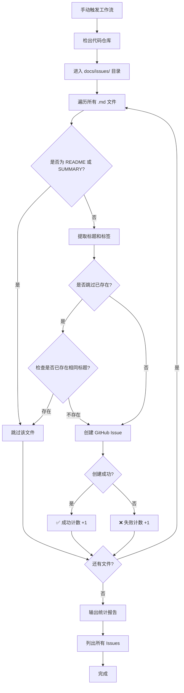

# 🚀 GitHub Actions 工作流使用指南

## 📋 工作流说明

我们创建了一个 GitHub Actions 工作流文件 `.github/workflows/init-issues.yml`，用于批量创建 GitHub Issues。

### ✨ 功能特性

- ✅ **手动触发**：通过 GitHub Actions UI 手动运行
- ✅ **自动读取**：自动读取 `docs/issues/` 目录下所有 Markdown 文件
- ✅ **智能解析**：
  - 从文件第一行提取 Issue 标题
  - 使用完整文件内容作为 Issue 描述
  - 自动提取 Labels（从文件的 Metadata 部分）
- ✅ **防重复创建**：可选择是否跳过已存在的同名 Issue
- ✅ **详细日志**：彩色输出，展示创建进度和统计信息

---

## 🎯 如何手动触发工作流

### 方法 1: 通过 GitHub Web UI（推荐）

#### 步骤 1: 打开 Actions 页面
访问你的仓库 Actions 页面：
```
https://github.com/litantai/SmartTrack/actions
```

或者在仓库页面点击顶部导航栏的 **"Actions"** 标签。

#### 步骤 2: 选择工作流
在左侧工作流列表中，找到并点击：
```
批量创建 GitHub Issues (Batch Create GitHub Issues)
```

#### 步骤 3: 运行工作流
1. 点击右侧的 **"Run workflow"** 按钮（蓝色下拉按钮）
2. 在弹出的对话框中：
   - **Branch**: 选择 `main` 或你当前的分支
   - **是否跳过已存在的 Issue**: 
     - 选择 `true`（推荐）：会检查是否已存在相同标题的 Issue，存在则跳过
     - 选择 `false`：即使存在同名 Issue 也会重复创建
3. 点击绿色的 **"Run workflow"** 按钮确认运行

#### 步骤 4: 查看执行结果
1. 工作流开始运行后，会在列表中显示
2. 点击运行记录可查看详细日志
3. 展开每个步骤查看执行细节
4. 成功后会显示 ✅ 绿色对勾

---

### 方法 2: 通过 GitHub CLI

如果你已安装 [GitHub CLI](https://cli.github.com/)，可以通过命令行触发：

```bash
# 基本用法（跳过已存在的 Issue）
gh workflow run "批量创建 GitHub Issues (Batch Create GitHub Issues)" \
  --ref main \
  -f skip_existing=true

# 不跳过已存在的 Issue（会重复创建）
gh workflow run "批量创建 GitHub Issues (Batch Create GitHub Issues)" \
  --ref main \
  -f skip_existing=false

# 查看工作流运行状态
gh run list --workflow="批量创建 GitHub Issues (Batch Create GitHub Issues)"

# 查看最新一次运行的日志
gh run view --log
```

---

### 方法 3: 通过 GitHub API

使用 `curl` 或其他 HTTP 客户端触发：

```bash
# 设置变量
GITHUB_TOKEN="your_personal_access_token"
REPO_OWNER="litantai"
REPO_NAME="SmartTrack"
WORKFLOW_ID="init-issues.yml"
BRANCH="main"

# 触发工作流
curl -X POST \
  -H "Authorization: token $GITHUB_TOKEN" \
  -H "Accept: application/vnd.github.v3+json" \
  "https://api.github.com/repos/$REPO_OWNER/$REPO_NAME/actions/workflows/$WORKFLOW_ID/dispatches" \
  -d '{
    "ref": "'"$BRANCH"'",
    "inputs": {
      "skip_existing": "true"
    }
  }'
```

---

## 📊 工作流执行流程



---

## 📁 文件格式要求

工作流会读取 `docs/issues/` 目录下的所有 `.md` 文件（自动排除 `README.md` 和 `SUMMARY.md`）。

### Issue 文件格式示例

```markdown
# Issue 标题会从这里提取

## 📋 Issue 元信息 (Metadata)

- **Issue Number**: #T004
- **Title**: Vehicle 模型定义
- **Labels**: `data-layer`, `priority:P1`, `complexity:medium`
- **Assignee**: 待分配

## 📝 Issue 内容

这里是 Issue 的详细内容...
```

### 标签提取规则

工作流会自动从文件中查找以下格式的标签：

```markdown
- **Labels**: `label1`, `label2`, `label3`
```

如果未找到 Labels，会自动使用默认标签 `auto-created`。

---

## ⚠️ 注意事项

### 1. 权限要求

工作流需要以下权限：
- ✅ `issues: write` - 创建 Issues
- ✅ `contents: read` - 读取仓库文件

这些权限已在工作流文件中配置，无需额外设置。

### 2. 防止重复创建

- 默认情况下，工作流会检查是否已存在相同标题的 Issue
- 如果存在，会跳过创建并在日志中标记为 "⏭️ 跳过"
- 如果需要强制重新创建，可以在运行时选择 `skip_existing=false`

### 3. 文件命名规范

- 建议使用 `ISSUE_XXX_DESCRIPTION.md` 格式命名文件
- 确保文件第一行是有效的 Markdown 标题（以 `#` 开头）
- 文件应使用 UTF-8 编码

### 4. 标签自动创建

- 如果工作流中使用的标签在仓库中不存在，GitHub 会自动创建该标签
- 建议提前在仓库中创建常用标签，以便设置颜色和描述

---

## 🔍 查看创建的 Issues

### 方法 1: GitHub Web UI
访问：
```
https://github.com/litantai/SmartTrack/issues
```

### 方法 2: GitHub CLI
```bash
# 列出所有 Issues
gh issue list

# 列出最近创建的 20 个 Issues
gh issue list --limit 20

# 筛选特定标签的 Issues
gh issue list --label "auto-created"
```

---

## 🛠️ 故障排查

### 问题 1: 工作流找不到 Markdown 文件

**原因**: `docs/issues/` 目录不存在或为空

**解决方案**: 
```bash
# 检查目录是否存在
ls -la docs/issues/

# 确保至少有一个 .md 文件（除了 README.md 和 SUMMARY.md）
```

### 问题 2: 创建 Issue 失败（权限错误）

**原因**: GitHub Token 权限不足

**解决方案**: 
1. 检查仓库设置 → Actions → General → Workflow permissions
2. 确保选择了 "Read and write permissions"

### 问题 3: 标签提取失败

**原因**: 文件中 Labels 格式不匹配

**解决方案**: 
确保文件中包含以下格式的标签定义：
```markdown
- **Labels**: `label1`, `label2`, `label3`
```

### 问题 4: Issue 标题为空

**原因**: 文件第一行不是有效的 Markdown 标题

**解决方案**: 
确保文件第一行格式为：
```markdown
# 这是 Issue 标题
```

---

## 📝 工作流配置文件位置

```
.github/workflows/init-issues.yml
```

如需自定义工作流行为，可以编辑此文件。

---

## 🎓 相关资源

- [GitHub Actions 文档](https://docs.github.com/en/actions)
- [GitHub CLI 文档](https://cli.github.com/)
- [GitHub Issues API](https://docs.github.com/en/rest/issues)
- [工作流语法参考](https://docs.github.com/en/actions/using-workflows/workflow-syntax-for-github-actions)

---

**最后更新**: 2026-01-27  
**创建者**: GitHub Copilot AI Assistant
