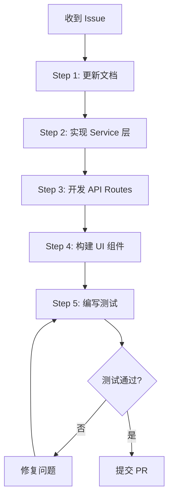

# SmartTrack AI 开发知识库
# AI Development Knowledge Base

> **文档定位**：本文档是 SmartTrack 项目的**核心技术知识库**，供 GitHub Copilot 及 AI 辅助工具在生成代码前理解项目架构、数据模型、业务规则和开发规范。

---

## 📋 目录

1. [项目概览](#1-项目概览)
2. [核心数据模型](#2-核心数据模型-core-data-models)
3. [架构分层设计](#3-架构分层设计)
4. [XState vs Zen Engine 分工](#4-xstate-vs-zen-engine-分工)
5. [API 标准规范](#5-api-标准规范)
6. [开发工作流](#6-开发工作流)
7. [测试驱动开发 (TDD)](#7-测试驱动开发-tdd)
8. [常用 Prompt 模板](#8-常用-prompt-模板)

---

## 1. 项目概览

### 1.1 项目定位
SmartTrack 是一个**局域网部署**的智能试车场综合管理系统，面向汽车测试场景，提供：
- 预约管理（Booking Management）
- 车辆档案（Vehicle Archive）
- 场地调度（Venue Scheduling）
- 实时监控（Real-time Monitoring）
- 数据分析（Analytics Dashboard）

### 1.2 技术栈
- **前端**：Next.js 15 (App Router) + React 19 + Tailwind CSS + ShadcnUI
- **后端**：Next.js API Routes (Node.js Runtime)
- **数据库**：MongoDB + Mongoose ODM
- **状态管理**：XState (业务流程状态机)
- **规则引擎**：Zen Engine (业务规则决策)
- **认证**：NextAuth.js v5 (Credentials Provider)
- **测试**：Jest (单元测试) + Playwright (E2E 测试)

### 1.3 核心原则
- **用户友好**：符合 B 端管理系统操作习惯，简洁直观
- **类型安全**：严格使用 TypeScript，禁止 `any` 类型
- **组件化**：遵循原子化设计，分层清晰
- **测试驱动**：核心业务逻辑测试覆盖率 ≥ 80%
- **离线优先**：所有依赖必须本地化，支持局域网部署

---

## 2. 核心数据模型 (Core Data Models)

### 2.1 用户模型 (User Schema)

**位置**：`lib/db/models/User.ts`

```typescript
interface IUser {
  _id: ObjectId;
  username: string;           // 用户名（唯一）
  email: string;              // 邮箱（唯一）
  passwordHash: string;       // 密码哈希（bcrypt）
  role: 'admin' | 'manager' | 'driver' | 'visitor'; // 角色
  profile: {
    fullName: string;         // 真实姓名
    phone?: string;           // 联系电话
    avatar?: string;          // 头像 URL（本地存储）
    licenseNumber?: string;   // 驾驶证号（仅 driver）
    licenseExpiry?: Date;     // 驾驶证有效期
  };
  status: 'active' | 'inactive' | 'suspended'; // 账号状态
  createdAt: Date;
  updatedAt: Date;
}
```

**索引**：
- `{ username: 1 }` - 唯一索引
- `{ email: 1 }` - 唯一索引
- `{ role: 1, status: 1 }` - 组合索引（角色查询）

---

### 2.2 车辆模型 (Vehicle Schema)

**位置**：`lib/db/models/Vehicle.ts`

```typescript
interface IVehicle {
  _id: ObjectId;
  vehicleId: string;          // 车辆编号（如 "V001"，唯一）
  plateNumber: string;        // 车牌号（唯一）
  brand: string;              // 品牌（如 "Tesla"）
  model: string;              // 型号（如 "Model 3"）
  type: 'sedan' | 'suv' | 'truck' | 'sport' | 'ev' | 'other'; // 车型
  status: 'available' | 'booked' | 'in-use' | 'maintenance' | 'retired'; // 状态
  specifications: {
    year: number;             // 生产年份
    color: string;            // 颜色
    engine?: string;          // 发动机型号
    transmission?: 'manual' | 'automatic'; // 变速箱
  };
  insurance: {
    provider: string;         // 保险公司
    policyNumber: string;     // 保单号
    expiryDate: Date;         // 到期日期
  };
  maintenance: {
    lastServiceDate?: Date;   // 上次保养日期
    nextServiceDue?: Date;    // 下次保养预期
    totalMileage: number;     // 总里程（公里）
  };
  createdAt: Date;
  updatedAt: Date;
}
```

**索引**：
- `{ vehicleId: 1 }` - 唯一索引
- `{ plateNumber: 1 }` - 唯一索引
- `{ status: 1 }` - 单字段索引（状态过滤）
- `{ type: 1, status: 1 }` - 组合索引（可用车辆查询）

---

### 2.3 场地模型 (Venue Schema)

**位置**：`lib/db/models/Venue.ts`

```typescript
interface IVenue {
  _id: ObjectId;
  venueId: string;            // 场地编号（如 "A01"，唯一）
  name: string;               // 场地名称（如 "高速环道"）
  type: 'track' | 'test-pad' | 'parking' | 'workshop'; // 场地类型
  capacity: number;           // 容纳车辆数
  features: string[];         // 特性标签（如 ["高速测试", "湿滑路面"]）
  location: {
    building?: string;        // 建筑物/区域
    floor?: string;           // 楼层
    coordinates?: {           // GPS 坐标（可选）
      latitude: number;
      longitude: number;
    };
  };
  pricing: {
    baseRate: number;         // 基础费率（元/小时）
    peakMultiplier: number;   // 高峰时段倍率
  };
  status: 'available' | 'occupied' | 'maintenance' | 'closed'; // 状态
  maintenanceSchedule?: {
    startDate: Date;
    endDate: Date;
    reason: string;
  };
  createdAt: Date;
  updatedAt: Date;
}
```

**索引**：
- `{ venueId: 1 }` - 唯一索引
- `{ type: 1, status: 1 }` - 组合索引（可用场地查询）

---

### 2.4 预约模型 (Booking Schema)

**位置**：`lib/db/models/Booking.ts`

```typescript
interface IBooking {
  _id: ObjectId;
  bookingId: string;          // 预约编号（如 "BK20260126001"，唯一）
  userId: ObjectId;           // 用户 ID（外键）
  vehicleId: ObjectId;        // 车辆 ID（外键）
  venueId: ObjectId;          // 场地 ID（外键）
  
  schedule: {
    startTime: Date;          // 开始时间
    endTime: Date;            // 结束时间
    duration: number;         // 时长（小时）
  };
  
  status: 'pending' | 'confirmed' | 'in-progress' | 'completed' | 'cancelled'; // 状态
  
  purpose: string;            // 预约目的（如 "高速稳定性测试"）
  priority: 'low' | 'normal' | 'high' | 'urgent'; // 优先级
  
  fee: {
    baseAmount: number;       // 基础费用
    discount?: number;        // 折扣
    finalAmount: number;      // 最终费用
  };
  
  approval?: {
    approvedBy?: ObjectId;    // 审批人 ID
    approvedAt?: Date;        // 审批时间
    rejectionReason?: string; // 拒绝原因
  };
  
  checkInOut?: {
    checkInTime?: Date;       // 签到时间
    checkOutTime?: Date;      // 签退时间
    actualDuration?: number;  // 实际时长
  };
  
  feedback?: {
    rating?: number;          // 评分（1-5）
    comment?: string;         // 评价内容
    issues?: string[];        // 问题记录
  };
  
  createdAt: Date;
  updatedAt: Date;
}
```

**索引**：
- `{ bookingId: 1 }` - 唯一索引
- `{ userId: 1, status: 1 }` - 组合索引（用户预约历史）
- `{ vehicleId: 1, 'schedule.startTime': 1 }` - 组合索引（车辆占用检查）
- `{ venueId: 1, 'schedule.startTime': 1 }` - 组合索引（场地占用检查）
- `{ status: 1, 'schedule.startTime': 1 }` - 组合索引（状态过滤）

---

## 3. 架构分层设计

### 3.1 目录结构

```
SmartTrack/
├── app/                          # Next.js App Router
│   ├── (auth)/                   # 认证相关页面（登录、注册）
│   ├── dashboard/                # 主控台页面
│   │   ├── bookings/            # 预约管理
│   │   ├── vehicles/            # 车辆管理
│   │   ├── venues/              # 场地管理
│   │   └── users/               # 用户管理
│   ├── api/                      # API Routes
│   │   ├── auth/                # 认证 API
│   │   ├── bookings/            # 预约 API
│   │   ├── vehicles/            # 车辆 API
│   │   ├── venues/              # 场地 API
│   │   └── health/              # 健康检查
│   ├── globals.css              # 全局样式
│   ├── layout.tsx               # 根布局
│   └── page.tsx                 # 首页
│
├── components/                   # 组件库
│   ├── ui/                      # 基础 UI 组件（ShadcnUI）
│   │   ├── button.tsx
│   │   ├── input.tsx
│   │   ├── table.tsx
│   │   └── ...
│   ├── business/                # 业务组件
│   │   ├── BookingCard.tsx
│   │   ├── VehicleStatus.tsx
│   │   └── VenueSelector.tsx
│   └── layout/                  # 布局组件
│       ├── Header.tsx
│       ├── Sidebar.tsx
│       └── Footer.tsx
│
├── lib/                          # 核心库
│   ├── auth/                    # 认证逻辑
│   │   └── auth.config.ts
│   ├── db/                      # 数据库
│   │   ├── models/              # Mongoose Models
│   │   │   ├── User.ts
│   │   │   ├── Vehicle.ts
│   │   │   ├── Venue.ts
│   │   │   └── Booking.ts
│   │   ├── services/            # Service 层（业务逻辑）
│   │   │   ├── user.service.ts
│   │   │   ├── vehicle.service.ts
│   │   │   ├── venue.service.ts
│   │   │   └── booking.service.ts
│   │   └── mongoose.ts          # 数据库连接
│   ├── state-machines/          # XState 状态机
│   │   ├── booking.machine.ts
│   │   └── vehicle.machine.ts
│   ├── rules/                   # Zen Engine 规则
│   │   ├── fee-calculation.rules.json
│   │   └── access-control.rules.json
│   ├── utils/                   # 工具函数
│   │   ├── api-response.ts     # API 响应工具
│   │   ├── date-helper.ts      # 日期工具
│   │   └── validators.ts       # 验证器
│   └── validations/             # Zod Schema
│       ├── user.schema.ts
│       ├── vehicle.schema.ts
│       └── booking.schema.ts
│
├── types/                        # TypeScript 类型定义
│   ├── models.ts                # 数据模型类型
│   ├── api.ts                   # API 类型
│   └── common.ts                # 通用类型
│
├── __tests__/                    # 测试文件
│   ├── unit/                    # 单元测试
│   │   ├── services/
│   │   └── utils/
│   └── e2e/                     # E2E 测试
│       └── booking-flow.spec.ts
│
├── docs/                         # 文档
│   ├── AI_DEVELOPMENT.md        # 本文档
│   ├── architecture/            # 架构文档
│   └── deployment/              # 部署文档
│
├── .github/                      # GitHub 配置
│   └── copilot-instructions.md  # Copilot 行为准则
│
├── Dockerfile                    # Docker 镜像
├── docker-compose.yml            # Docker Compose 配置
└── package.json                  # 依赖管理
```

---

### 3.2 分层职责

#### Layer 1: Data Layer (数据层)
- **位置**：`lib/db/models/`
- **职责**：定义 Mongoose Schema 和模型，负责数据结构和基本验证
- **原则**：仅包含数据结构，不包含业务逻辑

#### Layer 2: Service Layer (服务层)
- **位置**：`lib/db/services/`
- **职责**：封装所有业务逻辑和数据库操作
- **原则**：
  - 无 HTTP 依赖，纯 TypeScript 函数
  - 可被 API 和服务端组件复用
  - 包含事务处理和错误处理

#### Layer 3: API Layer (接口层)
- **位置**：`app/api/`
- **职责**：处理 HTTP 请求，参数校验，调用 Service
- **原则**：
  - RESTful 风格
  - 统一响应格式
  - 仅做参数转换和响应封装

#### Layer 4: Presentation Layer (表现层)
- **位置**：`app/`, `components/`
- **职责**：UI 渲染和用户交互
- **原则**：
  - 组件化、可复用
  - 使用 TanStack Query 管理客户端状态
  - 响应式设计

---

## 4. XState vs Zen Engine 分工

### 4.1 XState：状态流转管理

**核心职责**：管理业务实体的 `status` 字段的生命周期流转

#### 预约状态机 (Booking State Machine)

**位置**：`lib/state-machines/booking.machine.ts`

```typescript
import { createMachine, assign } from 'xstate';

export const bookingMachine = createMachine({
  id: 'booking',
  initial: 'pending',
  context: {
    bookingId: null,
    errorMessage: null,
  },
  states: {
    pending: {
      on: {
        CONFIRM: {
          target: 'confirmed',
          actions: assign({ errorMessage: null }),
        },
        CANCEL: {
          target: 'cancelled',
          actions: assign({ errorMessage: 'User cancelled' }),
        },
      },
    },
    confirmed: {
      on: {
        START: {
          target: 'in-progress',
          actions: 'recordCheckIn',
        },
        CANCEL: {
          target: 'cancelled',
          cond: 'canCancelConfirmed', // 守卫条件
        },
      },
    },
    'in-progress': {
      on: {
        COMPLETE: {
          target: 'completed',
          actions: 'recordCheckOut',
        },
      },
    },
    completed: {
      type: 'final',
    },
    cancelled: {
      type: 'final',
    },
  },
});
```

#### 车辆状态机 (Vehicle State Machine)

```typescript
export const vehicleMachine = createMachine({
  id: 'vehicle',
  initial: 'available',
  states: {
    available: {
      on: { BOOK: 'booked' },
    },
    booked: {
      on: {
        START_USE: 'in-use',
        CANCEL_BOOKING: 'available',
      },
    },
    'in-use': {
      on: {
        END_USE: 'available',
        REPORT_ISSUE: 'maintenance',
      },
    },
    maintenance: {
      on: { REPAIR_COMPLETE: 'available', RETIRE: 'retired' },
    },
    retired: {
      type: 'final',
    },
  },
});
```

---

### 4.2 Zen Engine：业务规则决策

**核心职责**：处理复杂的条件判断、计算和决策逻辑

#### 使用场景 1：费用计算规则

**位置**：`lib/rules/fee-calculation.rules.json`

```json
{
  "contentType": "application/vnd.gorules.decision",
  "nodes": [
    {
      "id": "input",
      "type": "inputNode",
      "content": {
        "fields": [
          { "name": "vehicleType", "type": "string" },
          { "name": "venueType", "type": "string" },
          { "name": "duration", "type": "number" },
          { "name": "isPeakHour", "type": "boolean" },
          { "name": "userLevel", "type": "string" }
        ]
      }
    },
    {
      "id": "fee-table",
      "type": "decisionTableNode",
      "content": {
        "hitPolicy": "first",
        "rules": [
          {
            "condition": "vehicleType == 'SUV' && venueType == 'track' && duration <= 2",
            "result": { "baseFee": 300, "discount": 0 }
          },
          {
            "condition": "vehicleType == 'SUV' && venueType == 'track' && duration > 2",
            "result": { "baseFee": 500, "discount": 0.1 }
          },
          {
            "condition": "vehicleType == 'sedan' && venueType == 'test-pad'",
            "result": { "baseFee": 200, "discount": 0.05 }
          }
        ]
      }
    },
    {
      "id": "apply-peak-multiplier",
      "type": "expressionNode",
      "content": {
        "expression": "isPeakHour ? baseFee * 1.5 : baseFee"
      }
    },
    {
      "id": "apply-user-discount",
      "type": "decisionTableNode",
      "content": {
        "rules": [
          {
            "condition": "userLevel == 'VIP'",
            "result": { "additionalDiscount": 0.2 }
          },
          {
            "condition": "userLevel == 'Gold'",
            "result": { "additionalDiscount": 0.1 }
          },
          {
            "condition": "userLevel == 'Regular'",
            "result": { "additionalDiscount": 0 }
          }
        ]
      }
    },
    {
      "id": "output",
      "type": "outputNode",
      "content": {
        "fields": [
          { "name": "finalFee", "type": "number" },
          { "name": "breakdown", "type": "object" }
        ]
      }
    }
  ],
  "edges": [
    { "source": "input", "target": "fee-table" },
    { "source": "fee-table", "target": "apply-peak-multiplier" },
    { "source": "apply-peak-multiplier", "target": "apply-user-discount" },
    { "source": "apply-user-discount", "target": "output" }
  ]
}
```

**Service 集成**：

```typescript
// lib/db/services/fee-calculator.service.ts
import { ZenEngine } from '@gorules/zen-engine';
import feeRules from '@/lib/rules/fee-calculation.rules.json';

export class FeeCalculatorService {
  static async calculateBookingFee(input: {
    vehicleType: string;
    venueType: string;
    duration: number;
    isPeakHour: boolean;
    userLevel: string;
  }) {
    const engine = new ZenEngine();
    const decision = engine.createDecision(feeRules);
    const result = await decision.evaluate(input);
    
    return {
      finalFee: result.finalFee,
      breakdown: result.breakdown,
    };
  }
}
```

---

#### 使用场景 2：准入校验规则

**位置**：`lib/rules/access-control.rules.json`

```json
{
  "contentType": "application/vnd.gorules.decision",
  "nodes": [
    {
      "id": "input",
      "type": "inputNode",
      "content": {
        "fields": [
          { "name": "userRole", "type": "string" },
          { "name": "hasValidLicense", "type": "boolean" },
          { "name": "vehicleInsuranceValid", "type": "boolean" },
          { "name": "venueStatus", "type": "string" }
        ]
      }
    },
    {
      "id": "check-access",
      "type": "decisionTableNode",
      "content": {
        "hitPolicy": "first",
        "rules": [
          {
            "condition": "venueStatus == 'closed' || venueStatus == 'maintenance'",
            "result": {
              "allowed": false,
              "reason": "场地当前不可用"
            }
          },
          {
            "condition": "userRole == 'visitor'",
            "result": {
              "allowed": false,
              "reason": "访客无预约权限，需升级为驾驶员"
            }
          },
          {
            "condition": "userRole == 'driver' && !hasValidLicense",
            "result": {
              "allowed": false,
              "reason": "驾驶证已过期或无效"
            }
          },
          {
            "condition": "!vehicleInsuranceValid",
            "result": {
              "allowed": false,
              "reason": "车辆保险已过期"
            }
          },
          {
            "condition": "userRole == 'driver' || userRole == 'manager' || userRole == 'admin'",
            "result": {
              "allowed": true,
              "reason": null
            }
          }
        ]
      }
    },
    {
      "id": "output",
      "type": "outputNode",
      "content": {
        "fields": [
          { "name": "allowed", "type": "boolean" },
          { "name": "reason", "type": "string" }
        ]
      }
    }
  ],
  "edges": [
    { "source": "input", "target": "check-access" },
    { "source": "check-access", "target": "output" }
  ]
}
```

---

### 4.3 技术选型对比表

| 维度 | XState | Zen Engine |
|------|--------|------------|
| **核心职责** | 状态流转管理 | 业务规则决策 |
| **输入** | 事件 (Events) | 数据 (Input Data) |
| **输出** | 新状态 (New State) | 决策结果 (Decision Result) |
| **配置方式** | TypeScript 代码 | JSON 配置文件 |
| **可视化** | 状态图 (State Diagram) | 决策表 (Decision Table) |
| **典型场景** | 工作流、审批流、生命周期 | 定价、权限、风险评估 |
| **修改成本** | 需改代码重部署 | 仅改 JSON 无需重启 |
| **复杂度** | 适合有限状态场景 | 适合多条件组合判断 |

---

## 5. API 标准规范

### 5.1 统一响应格式

**所有 API 必须返回以下格式**：

```typescript
// 类型定义：types/api.ts
export interface ApiResponse<T = any> {
  success: boolean;
  data: T | null;
  error: {
    code: string;
    message: string;
    details?: any;
  } | null;
  meta?: {
    pagination?: {
      page: number;
      pageSize: number;
      total: number;
      totalPages: number;
    };
    timestamp?: string;
  };
}
```

**工具函数**：

```typescript
// lib/utils/api-response.ts
export function successResponse<T>(
  data: T,
  meta?: ApiResponse<T>['meta']
): Response {
  return Response.json({
    success: true,
    data,
    error: null,
    meta: {
      ...meta,
      timestamp: new Date().toISOString(),
    },
  });
}

export function errorResponse(
  code: string,
  message: string,
  details?: any,
  status: number = 400
): Response {
  return Response.json(
    {
      success: false,
      data: null,
      error: { code, message, details },
      meta: {
        timestamp: new Date().toISOString(),
      },
    },
    { status }
  );
}
```

---

### 5.2 错误码规范

| 错误码 | 描述 | HTTP 状态码 |
|--------|------|-------------|
| `VALIDATION_ERROR` | 参数校验失败 | 400 |
| `UNAUTHORIZED` | 未登录或 Token 无效 | 401 |
| `FORBIDDEN` | 无权限访问 | 403 |
| `NOT_FOUND` | 资源不存在 | 404 |
| `CONFLICT` | 资源冲突（如时间冲突） | 409 |
| `INTERNAL_ERROR` | 服务器内部错误 | 500 |
| `DATABASE_ERROR` | 数据库操作失败 | 500 |

---

### 5.3 API 示例

#### 示例 1：创建预约

**请求**：
```http
POST /api/bookings
Content-Type: application/json

{
  "vehicleId": "67890abcdef",
  "venueId": "12345abcdef",
  "startTime": "2026-01-27T09:00:00Z",
  "endTime": "2026-01-27T11:00:00Z",
  "purpose": "高速稳定性测试"
}
```

**成功响应** (201 Created):
```json
{
  "success": true,
  "data": {
    "bookingId": "BK20260127001",
    "userId": "user123",
    "vehicleId": "67890abcdef",
    "venueId": "12345abcdef",
    "status": "pending",
    "schedule": {
      "startTime": "2026-01-27T09:00:00Z",
      "endTime": "2026-01-27T11:00:00Z",
      "duration": 2
    },
    "fee": {
      "baseAmount": 300,
      "discount": 0,
      "finalAmount": 300
    },
    "createdAt": "2026-01-26T14:45:00Z"
  },
  "error": null,
  "meta": {
    "timestamp": "2026-01-26T14:45:00.123Z"
  }
}
```

**错误响应** (409 Conflict):
```json
{
  "success": false,
  "data": null,
  "error": {
    "code": "CONFLICT",
    "message": "该时间段场地已被预约",
    "details": {
      "conflictingBooking": {
        "bookingId": "BK20260127000",
        "startTime": "2026-01-27T08:00:00Z",
        "endTime": "2026-01-27T10:00:00Z"
      }
    }
  },
  "meta": {
    "timestamp": "2026-01-26T14:45:00.123Z"
  }
}
```

---

#### 示例 2：获取预约列表（分页）

**请求**：
```http
GET /api/bookings?page=1&pageSize=20&status=confirmed
```

**响应** (200 OK):
```json
{
  "success": true,
  "data": [
    {
      "bookingId": "BK20260127001",
      "userId": "user123",
      "status": "confirmed",
      "schedule": {
        "startTime": "2026-01-27T09:00:00Z",
        "endTime": "2026-01-27T11:00:00Z"
      }
    }
  ],
  "error": null,
  "meta": {
    "pagination": {
      "page": 1,
      "pageSize": 20,
      "total": 45,
      "totalPages": 3
    },
    "timestamp": "2026-01-26T14:45:00.123Z"
  }
}
```

---

## 6. 开发工作流

### 6.1 Issue 驱动开发流程



### 6.2 详细步骤说明

#### Step 1: 文档优先
- 在 `docs/` 创建或更新功能文档
- 绘制数据流图和状态转换图
- 定义 API 接口规范

#### Step 2: Service 层
- 在 `lib/db/services/` 实现业务逻辑
- 编写单元测试 (`__tests__/unit/services/`)
- 确保纯函数，无 HTTP 依赖

#### Step 3: API Routes
- 在 `app/api/` 创建路由
- 使用 Zod 校验参数
- 调用 Service 并返回标准响应

#### Step 4: UI 组件
- 设计 ShadcnUI 组件
- 使用 TanStack Query 获取数据
- 实现响应式布局

#### Step 5: 测试
- 编写 Playwright E2E 测试
- 验证完整业务流程
- 检查错误处理

---

## 7. 测试驱动开发 (TDD)

### 7.1 单元测试 (Jest)

**示例：测试 Service 层**

```typescript
// __tests__/unit/services/booking.service.test.ts
import { BookingService } from '@/lib/db/services/booking.service';
import { connectDB } from '@/lib/db/mongoose';

describe('BookingService', () => {
  beforeAll(async () => {
    await connectDB();
  });

  describe('createBooking', () => {
    it('应该成功创建预约', async () => {
      const input = {
        userId: 'user123',
        vehicleId: 'vehicle456',
        venueId: 'venue789',
        startTime: new Date('2026-01-27T09:00:00Z'),
        endTime: new Date('2026-01-27T11:00:00Z'),
        purpose: '测试',
      };

      const booking = await BookingService.createBooking(input);
      
      expect(booking).toBeDefined();
      expect(booking.status).toBe('pending');
      expect(booking.schedule.duration).toBe(2);
    });

    it('应该检测到时间冲突', async () => {
      // 先创建一个预约
      await BookingService.createBooking({
        userId: 'user123',
        vehicleId: 'vehicle456',
        venueId: 'venue789',
        startTime: new Date('2026-01-27T09:00:00Z'),
        endTime: new Date('2026-01-27T11:00:00Z'),
        purpose: '测试',
      });

      // 尝试创建重叠时间的预约
      await expect(
        BookingService.createBooking({
          userId: 'user456',
          vehicleId: 'vehicle789',
          venueId: 'venue789', // 同一场地
          startTime: new Date('2026-01-27T10:00:00Z'), // 重叠时间
          endTime: new Date('2026-01-27T12:00:00Z'),
          purpose: '测试',
        })
      ).rejects.toThrow('时间冲突');
    });
  });
});
```

---

### 7.2 E2E 测试 (Playwright)

**示例：完整预约流程测试**

```typescript
// __tests__/e2e/booking-flow.spec.ts
import { test, expect } from '@playwright/test';

test.describe('预约管理流程', () => {
  test.beforeEach(async ({ page }) => {
    // 登录
    await page.goto('/login');
    await page.fill('[name="username"]', 'testuser');
    await page.fill('[name="password"]', 'password123');
    await page.click('button[type="submit"]');
    await expect(page).toHaveURL('/dashboard');
  });

  test('完整预约流程：创建 → 确认 → 签到 → 签退', async ({ page }) => {
    // Step 1: 创建预约
    await page.goto('/dashboard/bookings');
    await page.click('text=新建预约');
    
    await page.selectOption('[name="vehicleId"]', { label: 'Tesla Model 3 (V001)' });
    await page.selectOption('[name="venueId"]', { label: '高速环道 (A01)' });
    await page.fill('[name="startTime"]', '2026-01-27T09:00');
    await page.fill('[name="endTime"]', '2026-01-27T11:00');
    await page.fill('[name="purpose"]', '高速稳定性测试');
    
    await page.click('button:has-text("提交预约")');
    
    // 验证成功提示
    await expect(page.locator('.toast-success')).toContainText('预约创建成功');
    
    // Step 2: 查看预约详情
    const bookingCard = page.locator('.booking-card').first();
    await expect(bookingCard).toContainText('pending');
    await bookingCard.click();
    
    // Step 3: 管理员确认预约
    await page.click('button:has-text("确认预约")');
    await expect(page.locator('.booking-status')).toContainText('confirmed');
    
    // Step 4: 驾驶员签到
    await page.click('button:has-text("签到")');
    await expect(page.locator('.booking-status')).toContainText('in-progress');
    
    // Step 5: 驾驶员签退
    await page.click('button:has-text("签退")');
    await page.fill('[name="feedback"]', '测试顺利完成');
    await page.click('button:has-text("提交反馈")');
    
    await expect(page.locator('.booking-status')).toContainText('completed');
  });

  test('应该阻止时间冲突的预约', async ({ page }) => {
    await page.goto('/dashboard/bookings/new');
    
    // 选择已被占用的时间段
    await page.selectOption('[name="venueId"]', { label: '高速环道 (A01)' });
    await page.fill('[name="startTime"]', '2026-01-27T09:00');
    await page.fill('[name="endTime"]', '2026-01-27T11:00');
    
    await page.click('button:has-text("检查可用性")');
    
    // 验证冲突提示
    await expect(page.locator('.error-message')).toContainText('该时间段已被占用');
  });
});
```

---

### 7.3 测试覆盖率要求

- **Service 层**：≥ 80% 覆盖率
- **工具函数**：100% 覆盖率
- **关键业务流程**：必须有 E2E 测试

---

## 8. 常用 Prompt 模板

### 8.1 创建新功能模块

```plaintext
我需要添加一个【车辆维修记录】模块。请基于 `docs/AI_DEVELOPMENT.md` 规范：

1. 在 `lib/db/models` 定义 MaintenanceRecord Schema，包含以下字段：
   - vehicleId (外键)
   - maintenanceType (类型：常规保养/故障维修/检测)
   - description (描述)
   - cost (费用)
   - performedAt (维修时间)
   - performedBy (维修人员)

2. 在 `lib/db/services` 创建 maintenance.service.ts，包含：
   - createRecord(data): 创建维修记录
   - getRecordsByVehicle(vehicleId): 获取车辆所有维修记录
   - getUpcomingMaintenance(): 获取即将到期的保养提醒

3. 在 `app/api/maintenance` 创建 API Routes：
   - POST /api/maintenance (创建记录)
   - GET /api/maintenance?vehicleId=xxx (查询记录)

4. 在 `app/dashboard/maintenance` 使用 ShadcnUI Table 组件展示列表

5. 使用 React Hook Form + Zod 实现新增记录的弹窗表单

请严格遵循：
- TypeScript 严格模式
- 统一的 API 响应格式
- TanStack Query 做数据获取
```

---

### 8.2 重构现有组件

```plaintext
请重构 `components/business/VehicleCard.tsx` 组件。

当前问题：
- 代码混乱，所有逻辑在一个组件里
- 没有响应式布局
- 缺少 TypeScript 类型

重构要求：
1. 拆分为 VehicleCardHeader, VehicleCardBody, VehicleCardFooter 子组件
2. 使用 Tailwind CSS 实现响应式设计（支持 mobile/tablet/desktop）
3. 补充完整的 TypeScript 接口定义
4. 提取状态徽章为独立的 VehicleStatusBadge 组件
5. 添加骨架屏 (Skeleton) 加载状态

请保持：
- 原有的功能不变
- 符合 ShadcnUI 设计规范
```

---

### 8.3 实现业务规则

```plaintext
我需要实现【动态定价规则】，使用 Zen Engine 配置化实现。

规则逻辑：
1. 基础费率：
   - SUV + 高速环道：300 元/小时
   - 轿车 + 测试场：200 元/小时
   - 卡车 + 停车场：100 元/小时

2. 时长折扣：
   - ≤ 2 小时：无折扣
   - 2-4 小时：9 折
   - > 4 小时：8 折

3. 高峰时段加价：
   - 工作日 9:00-18:00：1.5 倍
   - 其他时段：1.0 倍

4. 会员优惠：
   - VIP 会员：额外 8 折
   - 黄金会员：额外 9 折
   - 普通用户：无额外折扣

请：
1. 在 `lib/rules/dynamic-pricing.rules.json` 定义规则
2. 在 `lib/db/services/pricing.service.ts` 集成 Zen Engine
3. 编写单元测试验证各种场景
4. 在 API `/api/bookings/calculate-fee` 中调用
```

---

## 📚 参考资源

- **Next.js 官方文档**：https://nextjs.org/docs
- **XState 文档**：https://xstate.js.org/docs
- **Zen Engine (GoRules)**：https://gorules.io/docs
- **ShadcnUI 组件库**：https://ui.shadcn.com
- **Playwright 测试**：https://playwright.dev
- **Mongoose ODM**：https://mongoosejs.com

---

**End of Knowledge Base** | 如有疑问，请参考 `.github/copilot-instructions.md` 了解 AI 行为准则。
