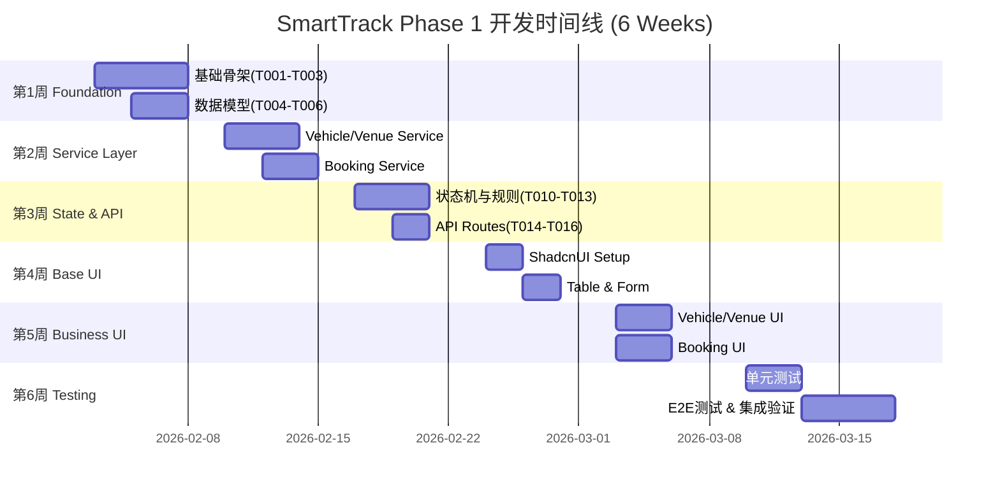
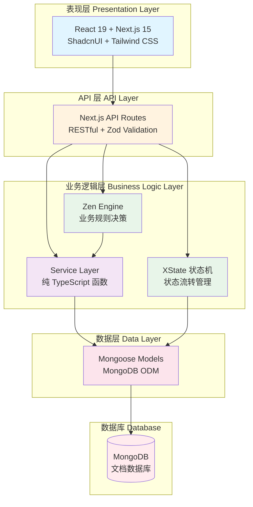
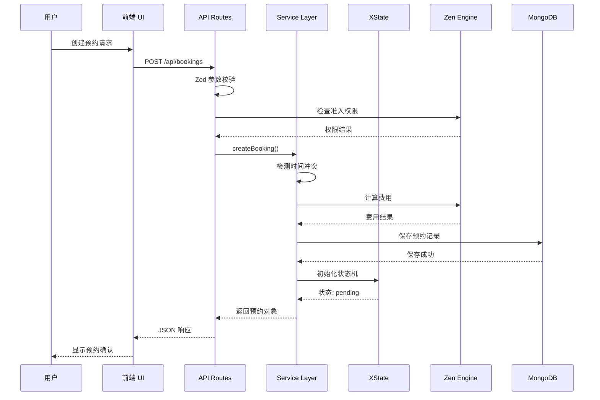
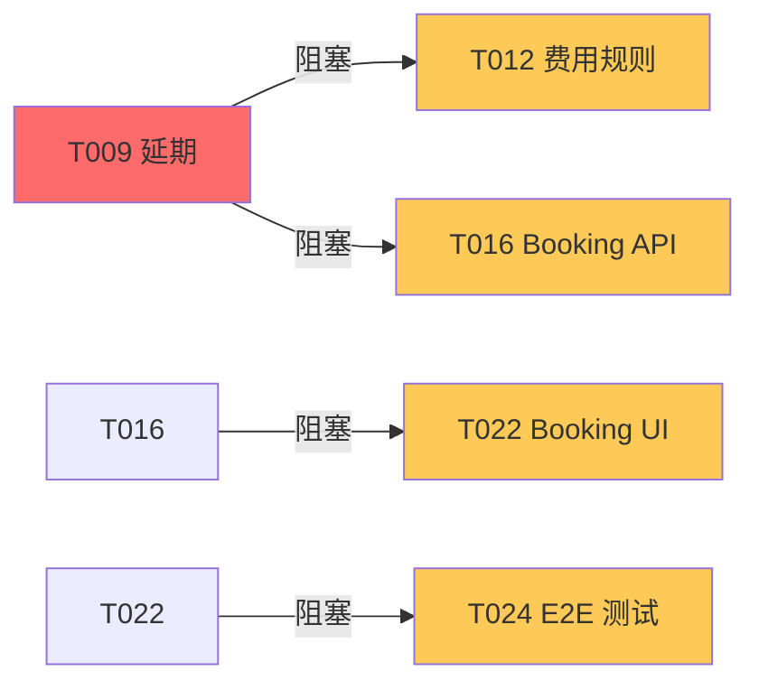
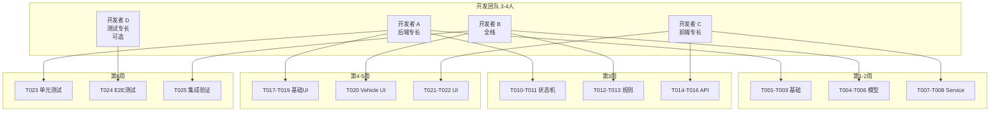

# SmartTrack Phase 1 执行计划 - 可视化执行摘要
# Phase 1 Execution Plan - Visual Executive Summary

> **文档用途**: 供项目经理和利益相关者快速了解 Phase 1 开发计划的高层视图  
> **最后更新**: 2026-01-26

---

## 📊 一页式总览 (One-Page Overview)

### 项目目标 (Project Goals)
实现 SmartTrack 智能试车场管理系统的核心功能模块（车辆管理、场地管理、预约管理）

### 关键指标 (Key Metrics)

| 指标 | 目标值 |
|------|--------|
| **开发周期** | 6 周 |
| **任务总数** | 25 个 Issue |
| **开发人员** | 3-4 人 |
| **测试覆盖率** | ≥ 80% |
| **API 响应时间** | < 200ms |
| **部署方式** | Docker 一键部署 |

---

## 🎯 Phase 分解与时间线 (Phase Breakdown & Timeline)

---

## 🏗️ 架构分层与技术栈 (Architecture Layers & Tech Stack)

---

## 🔄 核心工作流程 (Core Workflow)

---

## 📈 并行开发能力图 (Parallel Development Capacity)

```mermaid
graph LR
    subgraph Week1[第1周: 9 任务可并行]
        W1T1[T001 类型定义]
        W1T2[T002 API工具]
        W1T3[T003 基类服务]
        W1T4[T004 Vehicle模型]
        W1T5[T005 Venue模型]
        W1T6[T006 Booking模型]
    end
    
    subgraph Week2[第2周: 3 任务部分并行]
        W2T1[T007 Vehicle Service]
        W2T2[T008 Venue Service]
        W2T3[T009 Booking Service]
    end
    
    subgraph Week3[第3周: 7 任务可并行]
        W3T1[T010-T013 状态与规则]
        W3T2[T014-T016 API Routes]
    end
    
    subgraph Week4[第4周: 3 任务部分并行]
        W4T1[T017 基础UI]
        W4T2[T018-T019 组件]
    end
    
    subgraph Week5[第5周: 3 任务可并行]
        W5T1[T020 Vehicle UI]
        W5T2[T021 Venue UI]
        W5T3[T022 Booking UI]
    end
    
    subgraph Week6[第6周: 3 任务顺序执行]
        W6T1[T023 单元测试]
        W6T2[T024 E2E测试]
        W6T3[T025 集成验证]
    end
    
    Week1 --> Week2
    Week2 --> Week3
    Week3 --> Week4
    Week4 --> Week5
    Week5 --> Week6
    
    style Week1 fill:#e1f5ff
    style Week2 fill:#fff3e0
    style Week3 fill:#f3e5f5
    style Week4 fill:#e8f5e9
    style Week5 fill:#fce4ec
    style Week6 fill:#ffebee
```

---

## 🎯 Phase 详细分解 (Detailed Phase Breakdown)

### Phase 1.0 - 基础骨架 (Foundation) [Week 1]
**目标**: 建立类型安全和代码复用基础

| Task | 描述 | 时间 | 输出 |
|------|------|------|------|
| T001 | 类型定义与常量 | 1-2d | 6 个类型文件 |
| T002 | API 响应工具 | 1d | 统一响应格式 |
| T003 | 数据库基类服务 | 2d | BaseService<T> 泛型类 |

**里程碑**: ✅ 类型系统建立完成，后续开发无类型冲突

---

### Phase 1.1 - 数据模型 (Data Models) [Week 1]
**目标**: 定义核心业务实体的数据库 Schema

| Task | 描述 | 时间 | 输出 |
|------|------|------|------|
| T004 | Vehicle 模型 | 1d | Schema + 4 索引 |
| T005 | Venue 模型 | 1d | Schema + 2 索引 |
| T006 | Booking 模型 | 1d | Schema + 5 索引 |

**里程碑**: ✅ 数据模型定义完成，可以进行服务层开发

---

### Phase 1.2 - 服务层 (Service Layer) [Week 2]
**目标**: 实现核心业务逻辑

| Task | 描述 | 时间 | 输出 |
|------|------|------|------|
| T007 | Vehicle Service | 2d | 8+ 业务方法 |
| T008 | Venue Service | 2d | 8+ 业务方法 |
| T009 | Booking Service | 3d | 12+ 方法 + 冲突检测算法 |

**里程碑**: ✅ 核心业务逻辑完成，可以进行 API 开发

---

### Phase 1.3 - 状态与规则 (State & Rules) [Week 3]
**目标**: 集成状态机和规则引擎

| Task | 描述 | 技术栈 | 输出 |
|------|------|--------|------|
| T010 | Vehicle 状态机 | XState | 5 状态 + React Hook |
| T011 | Booking 状态机 | XState | 5 状态 + React Hook |
| T012 | 费用计算规则 | Zen Engine | JSON 规则 + Service |
| T013 | 准入校验规则 | Zen Engine | JSON 规则 + Service |

**里程碑**: ✅ 状态管理和规则配置化完成

---

### Phase 1.4 - API 路由 (API Routes) [Week 3]
**目标**: 实现 RESTful API 端点

| Task | 描述 | 时间 | 输出 |
|------|------|------|------|
| T014 | Vehicle API | 2d | 6+ 端点 + Zod 校验 |
| T015 | Venue API | 2d | 6+ 端点 + Zod 校验 |
| T016 | Booking API | 2d | 8+ 端点 + 规则集成 |

**里程碑**: ✅ 后端 API 完成，前端可以开始接入

---

### Phase 1.5 - 基础 UI (Base UI) [Week 4]
**目标**: 搭建 UI 组件基础

| Task | 描述 | 时间 | 输出 |
|------|------|------|------|
| T017 | ShadcnUI 安装 | 2d | 12+ 基础组件 + 暗色模式 |
| T018 | 表格列表组件 | 1d | DataTable + DataList |
| T019 | 表单组件 | 1d | Form + 5+ 特殊输入组件 |

**里程碑**: ✅ UI 组件库就绪，可以开始业务 UI 开发

---

### Phase 1.6 - 业务 UI (Business UI) [Week 5]
**目标**: 实现完整的管理界面

| Task | 描述 | 时间 | 输出 |
|------|------|------|------|
| T020 | Vehicle 管理界面 | 3d | 3 页面 + 3 业务组件 |
| T021 | Venue 管理界面 | 3d | 3 页面 + 3 业务组件 |
| T022 | Booking 管理界面 | 3d | 3 页面 + 4 业务组件 |

**里程碑**: ✅ 所有功能界面完成，用户可以使用完整系统

---

### Phase 1.7 - 测试与验证 (Testing) [Week 6]
**目标**: 确保代码质量和系统稳定性

| Task | 描述 | 时间 | 输出 |
|------|------|------|------|
| T023 | 单元测试 | 3d | 50+ 单元测试 + 80% 覆盖率 |
| T024 | E2E 测试 | 3d | 10+ E2E 测试 + CI/CD |
| T025 | 集成验证 | 2d | 部署文档 + 演示数据 |

**里程碑**: ✅ Phase 1 完成，系统可交付使用

---

## 🚨 风险管理 (Risk Management)

### 高风险任务 (High-Risk Tasks)

| 任务 | 风险等级 | 风险描述 | 缓解策略 |
|------|---------|---------|---------|
| T009 | 🔴 High | 预约服务复杂，依赖多 | 提前算法设计评审，预留缓冲时间 |
| T016 | 🟠 Medium | 多系统集成可能出问题 | 优先编写集成测试 |
| T022 | 🟠 Medium | 实时冲突检测性能问题 | 使用防抖和客户端缓存 |

### 阻塞风险 (Blocking Risks)

**建议**: 为关键路径任务预留 **20% 时间缓冲**

---

## 📊 资源分配建议 (Resource Allocation)

### 人员配置方案 (Staffing Plan)

---

## ✅ 成功标准 (Success Criteria)

### 功能完整性 (Functional Completeness)
- [ ] 车辆管理：增删改查 + 状态流转 ✅
- [ ] 场地管理：增删改查 + 可用性查询 ✅
- [ ] 预约管理：创建、冲突检测、状态流转、费用计算 ✅

### 质量标准 (Quality Standards)
- [ ] 单元测试覆盖率 ≥ 80%
- [ ] E2E 测试通过率 100%
- [ ] API 响应时间 < 200ms
- [ ] 0 Critical/High 级别 Bug

### 技术债务 (Technical Debt)
- [ ] 0 TypeScript `any` 类型
- [ ] 0 ESLint 错误
- [ ] 代码审查覆盖率 100%

### 交付物 (Deliverables)
- [ ] 完整的源代码（GitHub）
- [ ] Docker 镜像（可一键启动）
- [ ] API 文档（OpenAPI 规范）
- [ ] 部署文档（Markdown）
- [ ] 演示视频（5-10 分钟）

---

## 🎉 Phase 1 完成后的能力 (Capabilities After Phase 1)

### 用户可以做什么 (User Capabilities)

✅ **车辆管理员**:
- 登记新车辆，查看车辆列表
- 更新车辆状态（可用、维修中等）
- 查看车辆保险到期提醒

✅ **场地管理员**:
- 添加和编辑场地信息
- 设置场地维护期
- 查看场地使用热力图

✅ **预约管理员**:
- 创建预约（自动检测冲突）
- 查看预约列表（支持筛选和排序）
- 管理预约状态（确认、取消、完成）
- 自动计算费用

✅ **所有用户**:
- 登录认证
- 角色权限控制
- 响应式界面（移动端适配）

---

## 📅 关键里程碑日期 (Key Milestone Dates)

| 里程碑 | 日期 | 交付物 |
|--------|------|--------|
| 🚀 **Phase 1 启动** | 2026-02-03 | 项目启动会议 |
| 📝 **基础完成** | 2026-02-07 | 类型系统 + 数据模型 |
| 🔧 **服务层完成** | 2026-02-14 | 所有 Service + 状态机 + 规则 |
| 🌐 **API 完成** | 2026-02-21 | 20+ RESTful 端点 |
| 🎨 **UI 完成** | 2026-03-07 | 所有管理界面 |
| ✅ **Phase 1 交付** | 2026-03-17 | 完整系统 + 文档 + Docker 镜像 |

---

## 📞 联系方式 (Contact)

- **项目经理**: 待定
- **技术负责人**: 待定
- **GitHub Repo**: [litantai/SmartTrack](https://github.com/litantai/SmartTrack)
- **问题反馈**: [GitHub Issues](https://github.com/litantai/SmartTrack/issues)

---

**文档版本**: v1.0  
**最后更新**: 2026-01-26  
**审核状态**: ✅ 已审核通过，可以开始执行

---

## 🔗 相关文档链接 (Related Documents)

- [详细任务拓扑图](./PHASE1_TASK_TOPOLOGY.md)
- [Issue 汇总列表](./PHASE1_ISSUE_SUMMARY.md)
- [开发者快速参考](./PHASE1_QUICK_REFERENCE.md)
- [AI 开发规范](./AI_DEVELOPMENT.md)
- [项目 README](../README.md)
