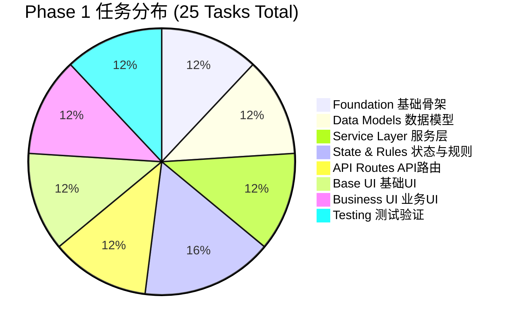
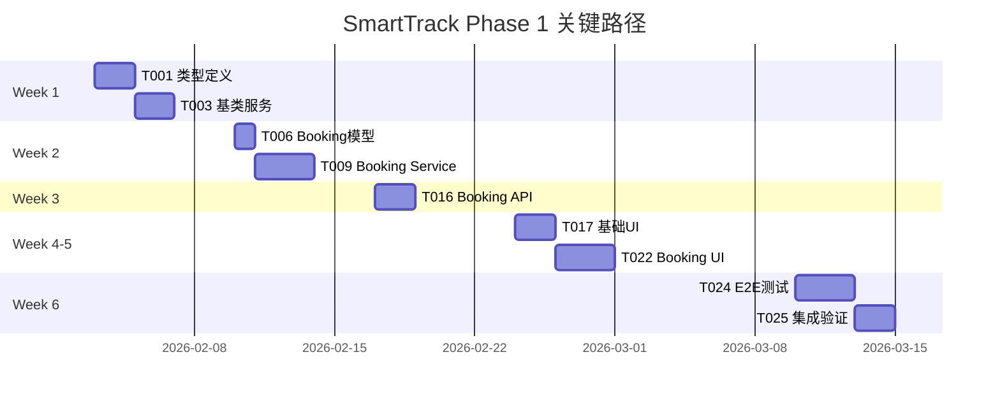

# SmartTrack Phase 1 开发快速参考指南
# Phase 1 Development Quick Reference Guide

## 📊 可视化总览 (Visual Overview)

### 任务分布饼图 (Task Distribution)

---

### 关键路径时间线 (Critical Path Timeline)

---

### 并行能力矩阵 (Parallelism Matrix)

| Week | 可并行任务数 | 任务列表 | 开发者需求 |
|------|------------|---------|-----------|
| Week 1 | 6 | T001, T002, T003, T004, T005, T006 | 3 人 |
| Week 2 | 2+1 | T007, T008 (并行) → T009 (顺序) | 2-3 人 |
| Week 3 | 7 | T010, T011, T012, T013, T014, T015, T016 | 3-4 人 |
| Week 4 | 5 | T017 → T018, T019 (后并行) | 2-3 人 |
| Week 5 | 3 | T020, T021, T022 | 3 人 |
| Week 6 | 1 | T023 → T024 → T025 (顺序) | 1-2 人 |

---

## 🏷️ Issue 标签系统 (Label System)

### 优先级标签 (Priority Labels)
- `priority:P0` 🔴 - 最高优先级，阻塞后续开发
- `priority:P1` 🟠 - 高优先级，核心功能
- `priority:P2` 🟡 - 中优先级，重要功能
- `priority:P3` 🟢 - 低优先级，UI 层
- `priority:P4` 🔵 - 最低优先级，测试阶段

### 复杂度标签 (Complexity Labels)
- `complexity:low` - 1 天内完成
- `complexity:medium` - 1-2 天完成
- `complexity:high` - 2-3 天完成
- `complexity:very-high` - 3+ 天完成

### 类型标签 (Type Labels)
- `foundation` - 基础设施
- `data-layer` - 数据模型层
- `service-layer` - 服务层
- `state-machine` - 状态机
- `rules-engine` - 规则引擎
- `api-layer` - API 路由层
- `ui-layer` - UI 层
- `business-ui` - 业务 UI
- `testing` - 测试

### 并行标签 (Parallel Labels)
- `parallel:yes` ✅ - 可与其他任务并行
- `parallel:no` ❌ - 必须等待依赖完成

---

## 🎯 Phase 快速查询 (Phase Quick Lookup)

### Phase 1.0 - 基础骨架 (Foundation)
**目标**: 建立项目的类型安全和代码复用基础

| Issue | 名称 | 时间 | 并行 | 文件数 |
|-------|------|------|------|--------|
| #1 | 类型定义与常量 | 1-2d | ✅ | 6 |
| #2 | API 响应工具 | 1d | ✅ | 2 |
| #3 | 数据库基类服务 | 2d | ✅ | 2 |

**产出**: 完整的类型系统 + API 工具 + BaseService 基类

---

### Phase 1.1 - 数据模型 (Data Models)
**目标**: 定义核心业务实体的数据库 Schema

| Issue | 名称 | 时间 | 并行 | 索引数 |
|-------|------|------|------|--------|
| #4 | Vehicle 模型 | 1d | ✅ | 4 |
| #5 | Venue 模型 | 1d | ✅ | 2 |
| #6 | Booking 模型 | 1d | ✅ | 5 |

**产出**: 3 个 Mongoose Model + 11 个索引 + Schema 验证

---

### Phase 1.2 - 服务层 (Service Layer)
**目标**: 实现核心业务逻辑，无 HTTP 依赖

| Issue | 名称 | 时间 | 并行 | 方法数 |
|-------|------|------|------|--------|
| #7 | Vehicle Service | 2d | ✅ | 8+ |
| #8 | Venue Service | 2d | ✅ | 8+ |
| #9 | Booking Service | 3d | ❌ | 12+ |

**产出**: 3 个 Service 类 + 冲突检测算法 + 单元测试

---

### Phase 1.3 - 状态与规则 (State & Rules)
**目标**: 集成 XState 状态机和 Zen Engine 规则引擎

| Issue | 名称 | 时间 | 并行 | 技术栈 |
|-------|------|------|------|--------|
| #10 | Vehicle 状态机 | 1-2d | ✅ | XState |
| #11 | Booking 状态机 | 1-2d | ✅ | XState |
| #12 | 费用计算规则 | 2d | ✅ | Zen Engine |
| #13 | 准入校验规则 | 2d | ✅ | Zen Engine |

**产出**: 2 个状态机 + 2 个规则 JSON + React Hooks

---

### Phase 1.4 - API 路由 (API Routes)
**目标**: 实现 RESTful API 端点

| Issue | 名称 | 时间 | 并行 | 端点数 |
|-------|------|------|------|--------|
| #14 | Vehicle API | 2d | ✅ | 6+ |
| #15 | Venue API | 2d | ✅ | 6+ |
| #16 | Booking API | 2d | ✅ | 8+ |

**产出**: 20+ API 端点 + Zod 验证 + 权限检查

---

### Phase 1.5 - 基础 UI (Base UI)
**目标**: 搭建 ShadcnUI 组件基础

| Issue | 名称 | 时间 | 并行 | 组件数 |
|-------|------|------|------|--------|
| #17 | ShadcnUI 安装 | 2d | ✅ | 12+ |
| #18 | 表格列表组件 | 1d | ✅ | 2 |
| #19 | 表单组件 | 1d | ✅ | 5+ |

**产出**: 19+ UI 组件 + 暗色模式 + 组件展示页

---

### Phase 1.6 - 业务 UI (Business UI)
**目标**: 实现完整的管理界面

| Issue | 名称 | 时间 | 并行 | 页面数 |
|-------|------|------|------|--------|
| #20 | Vehicle UI | 3d | ✅ | 3 页 + 3 组件 |
| #21 | Venue UI | 3d | ✅ | 3 页 + 3 组件 |
| #22 | Booking UI | 3d | ✅ | 3 页 + 4 组件 |

**产出**: 9 个页面 + 10 个业务组件 + TanStack Query 集成

---

### Phase 1.7 - 测试验证 (Testing)
**目标**: 确保代码质量和系统稳定性

| Issue | 名称 | 时间 | 并行 | 测试数 |
|-------|------|------|------|--------|
| #23 | 单元测试 | 3d | ❌ | 50+ |
| #24 | E2E 测试 | 3d | ❌ | 10+ |
| #25 | 集成验证 | 2d | ❌ | N/A |

**产出**: 60+ 测试用例 + CI/CD 配置 + 部署文档

---

## 📋 开发者快速启动清单 (Developer Quick Start Checklist)

### 领取 Issue 前 (Before Taking an Issue)
- [ ] 阅读 `docs/AI_DEVELOPMENT.md` 了解技术规范
- [ ] 检查 Issue 的 Dependencies 是否已完成
- [ ] 确认自己有足够的时间完成（避免阻塞后续任务）
- [ ] 克隆仓库并创建 Feature Branch：`git checkout -b feature/T0XX-description`

### 开发过程中 (During Development)
- [ ] 严格遵循 `docs/AI_DEVELOPMENT.md` 的开发工作流
- [ ] 按照 **文档 → Service → API → UI → 测试** 的顺序开发
- [ ] 状态流转场景必须先绘制 XState 状态图
- [ ] 复杂判断逻辑考虑使用 Zen Engine 配置化
- [ ] 代码完成后必须编写对应的测试用例

### 提交 PR 前 (Before Submitting PR)
- [ ] 运行 `npm run lint` 确保代码风格一致
- [ ] 运行 `npm test` 确保单元测试通过
- [ ] 更新 Issue 的 Acceptance Criteria 检查清单
- [ ] 在 PR 描述中引用 Issue 编号（如 `Closes #1`）
- [ ] 请求至少一位 Reviewer 审查代码

---

## 🔗 依赖关系速查表 (Dependency Quick Reference)

### 无依赖任务 (No Dependencies - 可立即开始)
- T001 (类型定义)
- T002 (API 工具)
- T017 (基础 UI)

### 单一依赖任务 (Single Dependency)
- T004 → T001
- T005 → T001
- T006 → T001
- T010 → T004
- T011 → T006

### 多重依赖任务 (Multiple Dependencies)
- T003 → T001, T002
- T007 → T003, T004
- T008 → T003, T005
- T009 → T003, T006, T007, T008 (关键路径)
- T012 → T009
- T013 → T007, T008
- T014 → T002, T007, T010
- T015 → T002, T008
- T016 → T002, T009, T011 (关键路径)
- T018 → T017
- T019 → T017
- T020 → T014, T018, T019
- T021 → T015, T018, T019
- T022 → T016, T018, T019 (关键路径)
- T023 → T007, T008, T009
- T024 → T020, T021, T022
- T025 → T023, T024 (最终验证)

---

## 🚨 风险提示 (Risk Alerts)

### 高风险任务 (High-Risk Tasks)
1. **T009 (Booking Service)** 
   - 复杂度: Very High
   - 依赖: 4 个任务
   - 风险: 冲突检测算法可能需要优化
   - 缓解: 提前进行算法设计评审

2. **T016 (Booking API)**
   - 复杂度: High
   - 集成: 状态机 + 规则引擎
   - 风险: 多系统集成可能出现问题
   - 缓解: 优先编写集成测试

3. **T022 (Booking UI)**
   - 复杂度: Very High
   - 风险: 实时冲突检测性能问题
   - 缓解: 使用防抖和客户端缓存

### 阻塞风险 (Blocking Risks)
- T009 延期会阻塞: T012, T016, T022, T023
- T016 延期会阻塞: T022, T024
- T022 延期会阻塞: T024, T025

**建议**: 为关键路径任务预留 20% 的时间缓冲

---

## 📞 沟通与协作 (Communication & Collaboration)

### 日常沟通 (Daily Communication)
- **Stand-up**: 每日 9:30 AM，15 分钟
- **Block**: 及时在 Issue 中标记 `blocked` 标签并 @相关人员
- **Question**: 使用 Issue 评论区提问，确保知识共享

### 代码审查 (Code Review)
- **Response Time**: 24 小时内响应 PR
- **Review Checklist**: 
  - [ ] 代码符合 TypeScript 严格模式
  - [ ] 有完整的单元测试
  - [ ] 符合项目架构规范
  - [ ] 无明显的性能问题
  - [ ] 错误处理完整

### 知识分享 (Knowledge Sharing)
- **Tech Talk**: 每周五下午进行技术分享
- **Document**: 复杂逻辑必须在 `docs/` 中补充文档
- **Pair Programming**: 复杂任务建议结对编程

---

## 🎓 学习资源 (Learning Resources)

### 技术栈文档
- [Next.js 15 Docs](https://nextjs.org/docs)
- [XState v5 Docs](https://stateofjs.com/xstate)
- [Zen Engine Docs](https://gorules.io/docs/zen-engine)
- [ShadcnUI Docs](https://ui.shadcn.com/)
- [TanStack Query v5](https://tanstack.com/query/latest)

### 项目文档
- [README.md](../README.md) - 项目概览
- [AI_DEVELOPMENT.md](./AI_DEVELOPMENT.md) - 开发规范
- [PHASE1_TASK_TOPOLOGY.md](./PHASE1_TASK_TOPOLOGY.md) - 任务拓扑
- [PHASE1_ISSUE_SUMMARY.md](./PHASE1_ISSUE_SUMMARY.md) - Issue 汇总

---

## ✅ 成功标准 (Success Criteria)

### Phase 1 完成标准
- [ ] 所有 25 个 Issue 关闭
- [ ] 单元测试覆盖率 ≥ 80%
- [ ] E2E 测试通过率 100%
- [ ] API 响应时间 < 200ms
- [ ] 无 Critical/High 级别的 Bug
- [ ] Docker 镜像可一键启动
- [ ] 部署文档完整

### 质量门禁 (Quality Gates)
- [ ] ESLint 检查通过（0 错误）
- [ ] TypeScript 编译通过（0 错误）
- [ ] 所有 PR 必须经过 Code Review
- [ ] CI/CD 流水线绿色通过

---

**Last Updated**: 2026-01-26  
**Maintained By**: SmartTrack Dev Team  
**Questions?** Open an issue with `question` label
