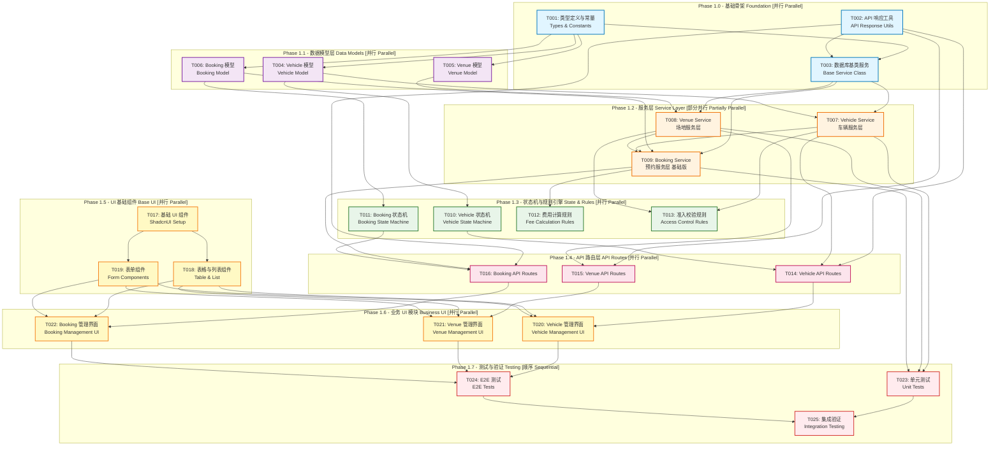

# SmartTrack Phase 1 开发任务拓扑图
# Phase 1 Development Task Topology

## 📊 任务依赖关系可视化 (Task Dependency Visualization)



---

## 🎯 并行开发策略 (Parallel Development Strategy)

### 批次 1 (Week 1): 基础设施 - **3 个任务可并行**
- T001: 类型定义与常量 (1-2 days)
- T002: API 响应工具 (1 day)
- T003: 数据库基类服务 (2 days)

**策略**: 三个开发者分别负责类型、API工具、基类服务

---

### 批次 2 (Week 1): 数据模型 - **3 个任务可并行**
- T004: Vehicle 模型 (1 day)
- T005: Venue 模型 (1 day)
- T006: Booking 模型 (1 day)

**策略**: 三个开发者分别负责不同的数据模型

---

### 批次 3 (Week 2): 服务层 - **2 个任务可并行 + 1 个顺序**
- T007: Vehicle Service (并行, 2 days)
- T008: Venue Service (并行, 2 days)
- T009: Booking Service (顺序, 依赖 T007 & T008, 3 days)

**策略**: 两个开发者先并行开发 Vehicle 和 Venue Service，第三个开发者在他们完成后开发 Booking Service

---

### 批次 4 (Week 2-3): 状态机与规则 - **4 个任务可并行**
- T010: Vehicle 状态机 (1-2 days)
- T011: Booking 状态机 (1-2 days)
- T012: 费用计算规则 (2 days)
- T013: 准入校验规则 (2 days)

**策略**: 四个开发者分别负责，配置化规则便于并行

---

### 批次 5 (Week 3): API 路由 - **3 个任务可并行**
- T014: Vehicle API Routes (2 days)
- T015: Venue API Routes (2 days)
- T016: Booking API Routes (2 days)

**策略**: 三个开发者分别负责不同模块的 API

---

### 批次 6 (Week 4): 基础 UI - **3 个任务可并行**
- T017: 基础 UI 组件 (2 days)
- T018: 表格与列表组件 (在 T017 完成后, 1 day)
- T019: 表单组件 (在 T017 完成后, 1 day)

**策略**: 一个开发者先做 T017，然后两个开发者并行做 T018 和 T019

---

### 批次 7 (Week 4-5): 业务 UI - **3 个任务可并行**
- T020: Vehicle 管理界面 (3 days)
- T021: Venue 管理界面 (3 days)
- T022: Booking 管理界面 (3 days)

**策略**: 三个开发者分别负责不同模块的 UI

---

### 批次 8 (Week 5-6): 测试与验证 - **顺序执行**
- T023: 单元测试 (3 days)
- T024: E2E 测试 (3 days)
- T025: 集成验证 (2 days)

**策略**: 按顺序完成，确保质量

---

## 📝 Issue 模版与详细定义

### T001: 类型定义与常量
**Priority**: P0 (最高)  
**Complexity**: Medium  
**Estimated Time**: 1-2 days

#### Context
建立项目的类型安全基础，定义所有核心数据模型的 TypeScript 接口和共享常量。

#### Dependencies
- None (第一批任务)

#### Parallelism
- ✅ 可与 T002, T003 并行

#### Tasks
1. 在 `types/models.ts` 定义所有数据模型接口
   - IUser, IVehicle, IVenue, IBooking
   - 确保与 docs/AI_DEVELOPMENT.md 一致
2. 在 `types/api.ts` 定义 API 请求响应接口
   - ApiResponse<T>
   - PaginationParams
   - ErrorCode enum
3. 在 `types/common.ts` 定义通用类型
   - Status 枚举
   - Role 枚举
   - Priority 枚举
4. 在 `lib/constants/` 创建常量文件
   - status.constants.ts
   - role.constants.ts
   - error-codes.constants.ts

#### Acceptance Criteria
- [ ] 所有类型定义符合 `docs/AI_DEVELOPMENT.md` 规范
- [ ] TypeScript 严格模式下无错误
- [ ] 导出的类型可在其他模块正常引用
- [ ] 常量文件包含所有必要的枚举值

#### Files to Create/Modify
- `types/models.ts` (create)
- `types/api.ts` (create)
- `types/common.ts` (create)
- `lib/constants/status.constants.ts` (create)
- `lib/constants/role.constants.ts` (create)
- `lib/constants/error-codes.constants.ts` (create)

---

### T002: API 响应工具
**Priority**: P0 (最高)  
**Complexity**: Low  
**Estimated Time**: 1 day

#### Context
创建统一的 API 响应格式工具函数，确保所有 API 返回一致的响应结构。

#### Dependencies
- None (第一批任务)

#### Parallelism
- ✅ 可与 T001, T003 并行

#### Tasks
1. 实现 `lib/utils/api-response.ts`
   - successResponse<T>() 函数
   - errorResponse() 函数
   - paginationResponse<T>() 函数
2. 定义错误码常量映射
3. 添加响应格式验证 (使用 Zod)
4. 编写单元测试

#### Acceptance Criteria
- [ ] 所有响应工具函数正确实现
- [ ] 符合 `docs/AI_DEVELOPMENT.md` 中的 API 标准规范
- [ ] 单元测试覆盖率 100%
- [ ] 类型安全，支持泛型

#### Files to Create/Modify
- `lib/utils/api-response.ts` (create)
- `__tests__/unit/utils/api-response.test.ts` (create)

---

### T003: 数据库基类服务
**Priority**: P0 (最高)  
**Complexity**: Medium  
**Estimated Time**: 2 days

#### Context
创建可复用的数据库服务基类，提供 CRUD 操作的通用实现，减少重复代码。

#### Dependencies
- T001 (需要类型定义)
- T002 (需要错误处理工具)

#### Parallelism
- ✅ 可与 T001, T002 并行（但需等待它们完成后才能完整集成）

#### Tasks
1. 创建 `lib/db/services/base.service.ts`
   - BaseService<T> 抽象类
   - 通用 CRUD 方法：create, findById, findAll, update, delete
   - 分页查询方法：findWithPagination
   - 错误处理和日志记录
2. 实现事务处理帮助函数
3. 添加数据验证钩子
4. 编写单元测试

#### Acceptance Criteria
- [ ] BaseService 类正确实现
- [ ] 支持泛型，可被其他 Service 继承
- [ ] 包含完整的错误处理
- [ ] 单元测试覆盖率 ≥ 80%

#### Files to Create/Modify
- `lib/db/services/base.service.ts` (create)
- `__tests__/unit/services/base.service.test.ts` (create)

---

### T004: Vehicle 模型
**Priority**: P1  
**Complexity**: Medium  
**Estimated Time**: 1 day

#### Context
实现车辆数据模型，包括 Mongoose Schema 定义和索引优化。

#### Dependencies
- T001 (需要 IVehicle 接口)

#### Parallelism
- ✅ 可与 T005, T006 并行

#### Tasks
1. 在 `lib/db/models/Vehicle.ts` 实现 Vehicle Schema
   - 根据 `docs/AI_DEVELOPMENT.md` 定义字段
   - 添加字段验证规则
   - 配置索引（vehicleId, plateNumber, status, type）
2. 添加虚拟字段和实例方法
3. 实现 Pre/Post hooks（如保存前验证）
4. 编写模型测试

#### Acceptance Criteria
- [ ] Vehicle Schema 完全符合 AI_DEVELOPMENT.md 规范
- [ ] 所有索引正确配置
- [ ] 字段验证规则完整
- [ ] 模型可正确导出并使用

#### Files to Create/Modify
- `lib/db/models/Vehicle.ts` (create)
- `__tests__/unit/models/vehicle.test.ts` (create)

---

### T005: Venue 模型
**Priority**: P1  
**Complexity**: Medium  
**Estimated Time**: 1 day

#### Context
实现场地数据模型，包括 Mongoose Schema 定义和索引优化。

#### Dependencies
- T001 (需要 IVenue 接口)

#### Parallelism
- ✅ 可与 T004, T006 并行

#### Tasks
1. 在 `lib/db/models/Venue.ts` 实现 Venue Schema
   - 根据 `docs/AI_DEVELOPMENT.md` 定义字段
   - 添加字段验证规则
   - 配置索引（venueId, type, status）
2. 添加虚拟字段（如 isAvailable）
3. 实现 Pre/Post hooks
4. 编写模型测试

#### Acceptance Criteria
- [ ] Venue Schema 完全符合 AI_DEVELOPMENT.md 规范
- [ ] 所有索引正确配置
- [ ] 定价规则字段完整
- [ ] 模型可正确导出并使用

#### Files to Create/Modify
- `lib/db/models/Venue.ts` (create)
- `__tests__/unit/models/venue.test.ts` (create)

---

### T006: Booking 模型
**Priority**: P1  
**Complexity**: High  
**Estimated Time**: 1 day

#### Context
实现预约数据模型，这是核心业务模型，包含复杂的关联关系和验证逻辑。

#### Dependencies
- T001 (需要 IBooking 接口)

#### Parallelism
- ✅ 可与 T004, T005 并行

#### Tasks
1. 在 `lib/db/models/Booking.ts` 实现 Booking Schema
   - 根据 `docs/AI_DEVELOPMENT.md` 定义字段
   - 配置外键关联（userId, vehicleId, venueId）
   - 添加复杂字段验证（时间范围、费用）
   - 配置多个组合索引
2. 添加虚拟字段（如 durationInHours）
3. 实现 Pre/Post hooks（如自动生成 bookingId）
4. 编写模型测试

#### Acceptance Criteria
- [ ] Booking Schema 完全符合 AI_DEVELOPMENT.md 规范
- [ ] 外键关联正确配置
- [ ] 所有组合索引正确配置
- [ ] 时间和费用验证逻辑完整

#### Files to Create/Modify
- `lib/db/models/Booking.ts` (create)
- `__tests__/unit/models/booking.test.ts` (create)

---

### T007: Vehicle Service
**Priority**: P1  
**Complexity**: Medium  
**Estimated Time**: 2 days

#### Context
实现车辆服务层，提供车辆管理的所有业务逻辑。

#### Dependencies
- T003 (需要 BaseService)
- T004 (需要 Vehicle Model)

#### Parallelism
- ✅ 可与 T008 并行

#### Tasks
1. 创建 `lib/db/services/vehicle.service.ts`
   - 继承 BaseService<IVehicle>
   - 实现特定业务方法：
     - getAvailableVehicles()
     - updateVehicleStatus()
     - checkMaintenanceDue()
     - getVehiclesByType()
2. 添加车辆可用性校验
3. 实现保险到期检查
4. 编写完整的单元测试

#### Acceptance Criteria
- [ ] 所有 CRUD 操作正常工作
- [ ] 车辆状态更新逻辑正确
- [ ] 可用性和保险校验完整
- [ ] 单元测试覆盖率 ≥ 80%

#### Files to Create/Modify
- `lib/db/services/vehicle.service.ts` (create)
- `__tests__/unit/services/vehicle.service.test.ts` (create)

---

### T008: Venue Service
**Priority**: P1  
**Complexity**: Medium  
**Estimated Time**: 2 days

#### Context
实现场地服务层，提供场地管理和查询的业务逻辑。

#### Dependencies
- T003 (需要 BaseService)
- T005 (需要 Venue Model)

#### Parallelism
- ✅ 可与 T007 并行

#### Tasks
1. 创建 `lib/db/services/venue.service.ts`
   - 继承 BaseService<IVenue>
   - 实现特定业务方法：
     - getAvailableVenues()
     - checkVenueAvailability(venueId, startTime, endTime)
     - getVenuesByType()
     - updateVenueStatus()
2. 实现维护期检查
3. 添加场地容量验证
4. 编写完整的单元测试

#### Acceptance Criteria
- [ ] 所有 CRUD 操作正常工作
- [ ] 场地可用性检查正确
- [ ] 维护期逻辑完整
- [ ] 单元测试覆盖率 ≥ 80%

#### Files to Create/Modify
- `lib/db/services/venue.service.ts` (create)
- `__tests__/unit/services/venue.service.test.ts` (create)

---

### T009: Booking Service (基础版)
**Priority**: P1  
**Complexity**: High  
**Estimated Time**: 3 days

#### Context
实现预约服务层的基础功能，不包含状态机和规则引擎（将在后续任务中集成）。

#### Dependencies
- T003 (需要 BaseService)
- T006 (需要 Booking Model)
- T007 (需要 Vehicle Service - 检查车辆可用性)
- T008 (需要 Venue Service - 检查场地可用性)

#### Parallelism
- ❌ 必须等待 T007 和 T008 完成

#### Tasks
1. 创建 `lib/db/services/booking.service.ts`
   - 继承 BaseService<IBooking>
   - 实现核心业务方法：
     - createBooking() - 基础版，不含状态机
     - checkConflicts() - 检测时间冲突
     - getUserBookings()
     - getBookingsByStatus()
     - calculateDuration()
2. 实现冲突检测算法
3. 添加时间范围验证
4. 编写完整的单元测试

#### Acceptance Criteria
- [ ] 预约创建逻辑正确（不含状态机）
- [ ] 时间冲突检测准确
- [ ] 车辆和场地可用性检查完整
- [ ] 单元测试覆盖率 ≥ 80%

#### Files to Create/Modify
- `lib/db/services/booking.service.ts` (create)
- `__tests__/unit/services/booking.service.test.ts` (create)

---

### T010: Vehicle 状态机
**Priority**: P2  
**Complexity**: Medium  
**Estimated Time**: 1-2 days

#### Context
使用 XState 实现车辆状态流转管理。

#### Dependencies
- T004 (需要 Vehicle Model)

#### Parallelism
- ✅ 可与 T011, T012, T013 并行

#### Tasks
1. 安装 XState 依赖：`npm install xstate @xstate/react`
2. 创建 `lib/state-machines/vehicle.machine.ts`
   - 定义状态：available, booked, in-use, maintenance, retired
   - 定义事件：BOOK, START_USE, END_USE, REPORT_ISSUE, REPAIR_COMPLETE, RETIRE
   - 添加守卫条件和副作用动作
3. 绘制 Mermaid 状态图到文档
4. 创建 React Hook：`hooks/useVehicleState.ts`
5. 编写状态机测试

#### Acceptance Criteria
- [ ] 状态机完全符合 docs/AI_DEVELOPMENT.md 规范
- [ ] 所有状态转换正确实现
- [ ] 守卫条件和动作完整
- [ ] 可视化文档完整

#### Files to Create/Modify
- `lib/state-machines/vehicle.machine.ts` (create)
- `hooks/useVehicleState.ts` (create)
- `docs/state-diagrams/vehicle-state.md` (create)
- `__tests__/unit/state-machines/vehicle.machine.test.ts` (create)

---

### T011: Booking 状态机
**Priority**: P2  
**Complexity**: Medium  
**Estimated Time**: 1-2 days

#### Context
使用 XState 实现预约生命周期状态管理。

#### Dependencies
- T006 (需要 Booking Model)

#### Parallelism
- ✅ 可与 T010, T012, T013 并行

#### Tasks
1. 创建 `lib/state-machines/booking.machine.ts`
   - 定义状态：pending, confirmed, in-progress, completed, cancelled
   - 定义事件：CONFIRM, START, COMPLETE, CANCEL
   - 添加守卫条件（如 canCancelConfirmed）
   - 实现副作用动作（recordCheckIn, recordCheckOut）
2. 绘制 Mermaid 状态图到文档
3. 创建 React Hook：`hooks/useBookingState.ts`
4. 编写状态机测试

#### Acceptance Criteria
- [ ] 状态机完全符合 docs/AI_DEVELOPMENT.md 规范
- [ ] 所有状态转换正确实现
- [ ] 守卫条件确保业务规则
- [ ] 可视化文档完整

#### Files to Create/Modify
- `lib/state-machines/booking.machine.ts` (create)
- `hooks/useBookingState.ts` (create)
- `docs/state-diagrams/booking-state.md` (create)
- `__tests__/unit/state-machines/booking.machine.test.ts` (create)

---

### T012: 费用计算规则 (Zen Engine)
**Priority**: P2  
**Complexity**: Medium  
**Estimated Time**: 2 days

#### Context
使用 Zen Engine 实现动态费用计算规则，支持无需重启的配置化调整。

#### Dependencies
- T009 (需要 Booking Service)

#### Parallelism
- ✅ 可与 T010, T011, T013 并行

#### Tasks
1. 安装 Zen Engine：`npm install @gorules/zen-engine`
2. 创建 `lib/rules/fee-calculation.rules.json`
   - 定义输入字段（vehicleType, venueType, duration, isPeakHour, userLevel）
   - 创建决策表节点（基础费用、时长折扣、高峰倍率、会员折扣）
   - 配置边连接
3. 创建 `lib/db/services/fee-calculator.service.ts`
   - 集成 Zen Engine 评估规则
   - 提供 calculateBookingFee() 方法
4. 编写单元测试

#### Acceptance Criteria
- [ ] 规则 JSON 完全符合 docs/AI_DEVELOPMENT.md 示例
- [ ] 费用计算逻辑准确
- [ ] 支持动态调整规则
- [ ] 单元测试覆盖所有场景

#### Files to Create/Modify
- `lib/rules/fee-calculation.rules.json` (create)
- `lib/db/services/fee-calculator.service.ts` (create)
- `__tests__/unit/services/fee-calculator.service.test.ts` (create)

---

### T013: 准入校验规则 (Zen Engine)
**Priority**: P2  
**Complexity**: Medium  
**Estimated Time**: 2 days

#### Context
使用 Zen Engine 实现预约准入校验规则，动态控制访问权限。

#### Dependencies
- T007 (需要 Vehicle Service)
- T008 (需要 Venue Service)

#### Parallelism
- ✅ 可与 T010, T011, T012 并行

#### Tasks
1. 创建 `lib/rules/access-control.rules.json`
   - 定义输入字段（userRole, hasValidLicense, vehicleInsuranceValid, venueStatus）
   - 创建决策表节点（多条件判断）
   - 配置拒绝原因
2. 创建 `lib/db/services/access-validator.service.ts`
   - 集成 Zen Engine 评估规则
   - 提供 validateBookingAccess() 方法
3. 编写单元测试

#### Acceptance Criteria
- [ ] 规则 JSON 完全符合 docs/AI_DEVELOPMENT.md 示例
- [ ] 所有准入条件正确实现
- [ ] 拒绝原因清晰明确
- [ ] 单元测试覆盖所有场景

#### Files to Create/Modify
- `lib/rules/access-control.rules.json` (create)
- `lib/db/services/access-validator.service.ts` (create)
- `__tests__/unit/services/access-validator.service.test.ts` (create)

---

### T014: Vehicle API Routes
**Priority**: P2  
**Complexity**: Medium  
**Estimated Time**: 2 days

#### Context
实现车辆管理的 RESTful API 路由。

#### Dependencies
- T002 (需要 API 响应工具)
- T007 (需要 Vehicle Service)
- T010 (需要 Vehicle State Machine)

#### Parallelism
- ✅ 可与 T015, T016 并行

#### Tasks
1. 创建 API 路由文件：
   - `app/api/vehicles/route.ts` (GET, POST)
   - `app/api/vehicles/[id]/route.ts` (GET, PUT, DELETE)
   - `app/api/vehicles/[id]/status/route.ts` (PATCH)
2. 实现参数校验（使用 Zod）
3. 集成状态机进行状态更新
4. 添加权限检查（基于 NextAuth）
5. 编写 API 测试

#### Acceptance Criteria
- [ ] 所有 CRUD 端点正常工作
- [ ] 响应格式符合 API 标准规范
- [ ] 参数校验完整
- [ ] 状态转换通过状态机控制

#### Files to Create/Modify
- `app/api/vehicles/route.ts` (create)
- `app/api/vehicles/[id]/route.ts` (create)
- `app/api/vehicles/[id]/status/route.ts` (create)
- `lib/validations/vehicle.schema.ts` (create)
- `__tests__/unit/api/vehicles.test.ts` (create)

---

### T015: Venue API Routes
**Priority**: P2  
**Complexity**: Medium  
**Estimated Time**: 2 days

#### Context
实现场地管理的 RESTful API 路由。

#### Dependencies
- T002 (需要 API 响应工具)
- T008 (需要 Venue Service)

#### Parallelism
- ✅ 可与 T014, T016 并行

#### Tasks
1. 创建 API 路由文件：
   - `app/api/venues/route.ts` (GET, POST)
   - `app/api/venues/[id]/route.ts` (GET, PUT, DELETE)
   - `app/api/venues/available/route.ts` (GET - 查询可用场地)
2. 实现参数校验（使用 Zod）
3. 添加权限检查
4. 编写 API 测试

#### Acceptance Criteria
- [ ] 所有 CRUD 端点正常工作
- [ ] 响应格式符合 API 标准规范
- [ ] 可用场地查询逻辑正确
- [ ] 参数校验完整

#### Files to Create/Modify
- `app/api/venues/route.ts` (create)
- `app/api/venues/[id]/route.ts` (create)
- `app/api/venues/available/route.ts` (create)
- `lib/validations/venue.schema.ts` (create)
- `__tests__/unit/api/venues.test.ts` (create)

---

### T016: Booking API Routes
**Priority**: P2  
**Complexity**: High  
**Estimated Time**: 2 days

#### Context
实现预约管理的 RESTful API 路由，集成状态机和规则引擎。

#### Dependencies
- T002 (需要 API 响应工具)
- T009 (需要 Booking Service)
- T011 (需要 Booking State Machine)

#### Parallelism
- ✅ 可与 T014, T015 并行

#### Tasks
1. 创建 API 路由文件：
   - `app/api/bookings/route.ts` (GET, POST)
   - `app/api/bookings/[id]/route.ts` (GET, PUT, DELETE)
   - `app/api/bookings/[id]/status/route.ts` (PATCH - 状态转换)
   - `app/api/bookings/check-conflict/route.ts` (POST - 冲突检测)
2. 集成费用计算规则 (T012)
3. 集成准入校验规则 (T013)
4. 实现参数校验（使用 Zod）
5. 添加权限检查
6. 编写 API 测试

#### Acceptance Criteria
- [ ] 所有端点正常工作
- [ ] 状态转换通过状态机控制
- [ ] 费用计算和准入校验集成
- [ ] 冲突检测准确

#### Files to Create/Modify
- `app/api/bookings/route.ts` (create)
- `app/api/bookings/[id]/route.ts` (create)
- `app/api/bookings/[id]/status/route.ts` (create)
- `app/api/bookings/check-conflict/route.ts` (create)
- `lib/validations/booking.schema.ts` (create)
- `__tests__/unit/api/bookings.test.ts` (create)

---

### T017: 基础 UI 组件 (ShadcnUI Setup)
**Priority**: P3  
**Complexity**: Medium  
**Estimated Time**: 2 days

#### Context
安装和配置 ShadcnUI 基础组件库，建立 UI 基础。

#### Dependencies
- None (可独立进行)

#### Parallelism
- ✅ 可独立开始，但 T018 和 T019 需要等它完成

#### Tasks
1. 安装 ShadcnUI：`npx shadcn-ui@latest init`
2. 添加基础组件：
   - button, input, label, card
   - dialog, dropdown-menu, popover
   - toast, alert, badge
   - skeleton, spinner
3. 配置主题和暗色模式
4. 创建组件展示页面（Storybook 风格）
5. 编写组件文档

#### Acceptance Criteria
- [ ] 所有基础组件正确安装
- [ ] 主题配置符合设计规范
- [ ] 暗色模式正常工作
- [ ] 组件展示页面完整

#### Files to Create/Modify
- `components/ui/button.tsx` (create)
- `components/ui/input.tsx` (create)
- `components/ui/card.tsx` (create)
- (等多个 ShadcnUI 组件)
- `app/ui-showcase/page.tsx` (create - 组件展示)
- `docs/ui-components.md` (create)

---

### T018: 表格与列表组件
**Priority**: P3  
**Complexity**: Medium  
**Estimated Time**: 1 day

#### Context
创建可复用的数据表格和列表组件，支持分页、排序、筛选。

#### Dependencies
- T017 (需要基础 UI 组件)

#### Parallelism
- ✅ 可与 T019 并行

#### Tasks
1. 安装 TanStack Table：`npm install @tanstack/react-table`
2. 创建 `components/ui/data-table.tsx`
   - 支持分页
   - 支持列排序
   - 支持列筛选
   - 支持行选择
3. 创建 `components/ui/data-list.tsx`（移动端友好的列表视图）
4. 编写使用示例和文档

#### Acceptance Criteria
- [ ] 数据表格功能完整
- [ ] 支持响应式设计
- [ ] 性能优化（虚拟滚动）
- [ ] 使用文档清晰

#### Files to Create/Modify
- `components/ui/data-table.tsx` (create)
- `components/ui/data-list.tsx` (create)
- `docs/ui-components.md` (update)

---

### T019: 表单组件
**Priority**: P3  
**Complexity**: Medium  
**Estimated Time**: 1 day

#### Context
创建可复用的表单组件，集成 React Hook Form 和 Zod 验证。

#### Dependencies
- T017 (需要基础 UI 组件)

#### Parallelism
- ✅ 可与 T018 并行

#### Tasks
1. 创建 `components/ui/form.tsx`（基于 React Hook Form）
2. 创建表单字段组件：
   - FormField, FormItem, FormLabel, FormControl
   - FormMessage, FormDescription
3. 创建特殊输入组件：
   - DateTimePicker
   - SelectWithSearch
   - MultiSelect
4. 编写使用示例和文档

#### Acceptance Criteria
- [ ] 表单组件功能完整
- [ ] 集成 Zod 验证
- [ ] 错误提示友好
- [ ] 使用文档清晰

#### Files to Create/Modify
- `components/ui/form.tsx` (create)
- `components/ui/date-time-picker.tsx` (create)
- `components/ui/select-with-search.tsx` (create)
- `docs/ui-components.md` (update)

---

### T020: Vehicle 管理界面
**Priority**: P3  
**Complexity**: High  
**Estimated Time**: 3 days

#### Context
实现车辆管理的完整 UI 界面，包括列表、详情、创建、编辑。

#### Dependencies
- T014 (需要 Vehicle API)
- T018 (需要表格组件)
- T019 (需要表单组件)

#### Parallelism
- ✅ 可与 T021, T022 并行

#### Tasks
1. 创建页面组件：
   - `app/dashboard/vehicles/page.tsx` (列表页)
   - `app/dashboard/vehicles/[id]/page.tsx` (详情页)
   - `app/dashboard/vehicles/new/page.tsx` (创建页)
2. 创建业务组件：
   - `components/business/VehicleCard.tsx`
   - `components/business/VehicleForm.tsx`
   - `components/business/VehicleStatusBadge.tsx`
3. 集成 TanStack Query 进行数据管理
4. 实现状态更新（调用状态机 API）
5. 编写 E2E 测试

#### Acceptance Criteria
- [ ] 列表页支持分页和筛选
- [ ] 创建和编辑表单验证完整
- [ ] 状态更新正常工作
- [ ] 响应式设计适配移动端

#### Files to Create/Modify
- `app/dashboard/vehicles/page.tsx` (create)
- `app/dashboard/vehicles/[id]/page.tsx` (create)
- `app/dashboard/vehicles/new/page.tsx` (create)
- `components/business/VehicleCard.tsx` (create)
- `components/business/VehicleForm.tsx` (create)
- `components/business/VehicleStatusBadge.tsx` (create)
- `__tests__/e2e/vehicle-management.spec.ts` (create)

---

### T021: Venue 管理界面
**Priority**: P3  
**Complexity**: High  
**Estimated Time**: 3 days

#### Context
实现场地管理的完整 UI 界面。

#### Dependencies
- T015 (需要 Venue API)
- T018 (需要表格组件)
- T019 (需要表单组件)

#### Parallelism
- ✅ 可与 T020, T022 并行

#### Tasks
1. 创建页面组件：
   - `app/dashboard/venues/page.tsx` (列表页)
   - `app/dashboard/venues/[id]/page.tsx` (详情页)
   - `app/dashboard/venues/new/page.tsx` (创建页)
2. 创建业务组件：
   - `components/business/VenueCard.tsx`
   - `components/business/VenueForm.tsx`
   - `components/business/VenueAvailabilityCalendar.tsx`
3. 集成 TanStack Query
4. 实现场地可用性可视化
5. 编写 E2E 测试

#### Acceptance Criteria
- [ ] 列表页支持分页和筛选
- [ ] 可用性日历正常显示
- [ ] 创建和编辑功能完整
- [ ] 响应式设计适配移动端

#### Files to Create/Modify
- `app/dashboard/venues/page.tsx` (create)
- `app/dashboard/venues/[id]/page.tsx` (create)
- `app/dashboard/venues/new/page.tsx` (create)
- `components/business/VenueCard.tsx` (create)
- `components/business/VenueForm.tsx` (create)
- `components/business/VenueAvailabilityCalendar.tsx` (create)
- `__tests__/e2e/venue-management.spec.ts` (create)

---

### T022: Booking 管理界面
**Priority**: P3  
**Complexity**: Very High  
**Estimated Time**: 3 days

#### Context
实现预约管理的完整 UI 界面，这是最复杂的业务模块。

#### Dependencies
- T016 (需要 Booking API)
- T018 (需要表格组件)
- T019 (需要表单组件)

#### Parallelism
- ✅ 可与 T020, T021 并行

#### Tasks
1. 创建页面组件：
   - `app/dashboard/bookings/page.tsx` (列表页)
   - `app/dashboard/bookings/[id]/page.tsx` (详情页)
   - `app/dashboard/bookings/new/page.tsx` (创建页)
2. 创建业务组件：
   - `components/business/BookingCard.tsx`
   - `components/business/BookingForm.tsx` (集成冲突检测)
   - `components/business/BookingTimeline.tsx` (状态流转可视化)
   - `components/business/BookingCalendar.tsx` (日历视图)
3. 集成 TanStack Query
4. 实现实时冲突检测
5. 实现状态转换按钮（基于状态机）
6. 编写 E2E 测试

#### Acceptance Criteria
- [ ] 列表页和日历视图切换正常
- [ ] 创建预约时实时检测冲突
- [ ] 状态转换符合状态机规则
- [ ] 费用自动计算正确

#### Files to Create/Modify
- `app/dashboard/bookings/page.tsx` (create)
- `app/dashboard/bookings/[id]/page.tsx` (create)
- `app/dashboard/bookings/new/page.tsx` (create)
- `components/business/BookingCard.tsx` (create)
- `components/business/BookingForm.tsx` (create)
- `components/business/BookingTimeline.tsx` (create)
- `components/business/BookingCalendar.tsx` (create)
- `__tests__/e2e/booking-management.spec.ts` (create)

---

### T023: 单元测试
**Priority**: P4  
**Complexity**: High  
**Estimated Time**: 3 days

#### Context
补充完整的单元测试，确保代码质量。

#### Dependencies
- T007, T008, T009 (需要 Service 层完成)

#### Parallelism
- ❌ 必须在 Service 和 Utils 完成后进行

#### Tasks
1. 配置 Jest 测试环境
2. 编写 Service 层测试
   - vehicle.service.test.ts
   - venue.service.test.ts
   - booking.service.test.ts
   - fee-calculator.service.test.ts
   - access-validator.service.test.ts
3. 编写 Utils 测试
4. 编写状态机测试
5. 确保测试覆盖率 ≥ 80%

#### Acceptance Criteria
- [ ] 所有 Service 方法有单元测试
- [ ] 测试覆盖率 ≥ 80%
- [ ] 所有测试通过
- [ ] 边界情况和错误处理覆盖

#### Files to Create/Modify
- `jest.config.js` (create)
- `__tests__/unit/services/*.test.ts` (create multiple)
- `__tests__/unit/utils/*.test.ts` (create multiple)
- `__tests__/unit/state-machines/*.test.ts` (create multiple)

---

### T024: E2E 测试
**Priority**: P4  
**Complexity**: High  
**Estimated Time**: 3 days

#### Context
编写端到端测试，验证完整的业务流程。

#### Dependencies
- T020, T021, T022 (需要所有 UI 完成)

#### Parallelism
- ❌ 必须在 UI 完成后进行

#### Tasks
1. 配置 Playwright
2. 编写完整业务流程测试：
   - 用户登录流程
   - 车辆管理流程（创建、编辑、状态更新）
   - 场地管理流程
   - 预约完整流程（创建 → 确认 → 进行中 → 完成）
   - 冲突检测流程
3. 编写错误处理测试
4. 配置 CI/CD 自动运行

#### Acceptance Criteria
- [ ] 所有核心业务流程有 E2E 测试
- [ ] 测试在 CI/CD 中自动运行
- [ ] 测试通过率 100%
- [ ] 测试可复现且稳定

#### Files to Create/Modify
- `playwright.config.ts` (create)
- `__tests__/e2e/auth-flow.spec.ts` (create)
- `__tests__/e2e/vehicle-management.spec.ts` (create)
- `__tests__/e2e/venue-management.spec.ts` (create)
- `__tests__/e2e/booking-flow.spec.ts` (create)
- `.github/workflows/e2e-tests.yml` (create)

---

### T025: 集成验证
**Priority**: P4  
**Complexity**: Medium  
**Estimated Time**: 2 days

#### Context
最终的集成验证，确保所有模块协同工作。

#### Dependencies
- T023 (需要单元测试通过)
- T024 (需要 E2E 测试通过)

#### Parallelism
- ❌ 必须在所有测试完成后进行

#### Tasks
1. 运行完整的测试套件
2. 进行性能测试
3. 进行安全审计
4. 验证 Docker 部署
5. 编写部署文档
6. 创建演示数据
7. 录制演示视频

#### Acceptance Criteria
- [ ] 所有单元测试和 E2E 测试通过
- [ ] 性能满足要求（API 响应时间 < 200ms）
- [ ] 无安全漏洞
- [ ] Docker 部署成功
- [ ] 文档完整

#### Files to Create/Modify
- `docs/deployment/phase1-deployment.md` (create)
- `docs/DEMO.md` (create)
- `scripts/seed-demo-data.ts` (create)

---

## 🎯 关键路径 (Critical Path)

基于依赖关系，关键路径为：

```
T001 → T003 → T006 → T009 → T016 → T022 → T024 → T025
```

**预计时长**：2 + 2 + 1 + 3 + 2 + 3 + 3 + 2 = **18 工作日**（约 3.5 周）

---

## 📅 时间线估算 (Timeline Estimation)

假设有 **3 名全职开发者** 并行工作：

- **Week 1**: Phase 1.0, 1.1, 1.2 部分（T001-T008）
- **Week 2**: Phase 1.2 完成, 1.3 开始（T009-T013）
- **Week 3**: Phase 1.3 完成, 1.4 开始（T014-T016）
- **Week 4**: Phase 1.5（T017-T019）
- **Week 5**: Phase 1.6（T020-T022）
- **Week 6**: Phase 1.7（T023-T025）

**总计**: **6 周**（约 1.5 个月）

---

## 🔄 迭代与调整建议

1. **每周评审**：每周五进行进度评审，调整优先级
2. **风险监控**：T009 和 T022 是复杂度最高的任务，需要重点关注
3. **灵活调整**：如果某个任务受阻，可以先跳过进行其他并行任务
4. **文档先行**：每个任务开始前，先完善相关文档

---

## 📌 注意事项

1. **防冲突策略**：
   - 严格遵循"接口先行"原则（T001 优先完成）
   - 使用 Git Feature Branch，每个任务独立分支
   - 及时合并到 main，避免长时间分支分离

2. **代码审查**：
   - 所有 PR 必须经过代码审查
   - Service 层代码需要两人审查
   - UI 组件需要进行设计审查

3. **测试优先**：
   - Service 层必须先写测试
   - 复杂业务逻辑采用 TDD
   - E2E 测试覆盖所有核心流程

---

## ✅ 任务状态追踪模板

| Task ID | 任务名称 | 负责人 | 状态 | 开始日期 | 完成日期 | 备注 |
|---------|----------|--------|------|----------|----------|------|
| T001 | 类型定义与常量 | - | 未开始 | - | - | - |
| T002 | API 响应工具 | - | 未开始 | - | - | - |
| ... | ... | ... | ... | ... | ... | ... |

**状态定义**：
- 未开始 (Not Started)
- 进行中 (In Progress)
- 代码审查中 (In Review)
- 测试中 (Testing)
- 已完成 (Completed)
- 已阻塞 (Blocked)

---

**End of Phase 1 Task Topology Document**
