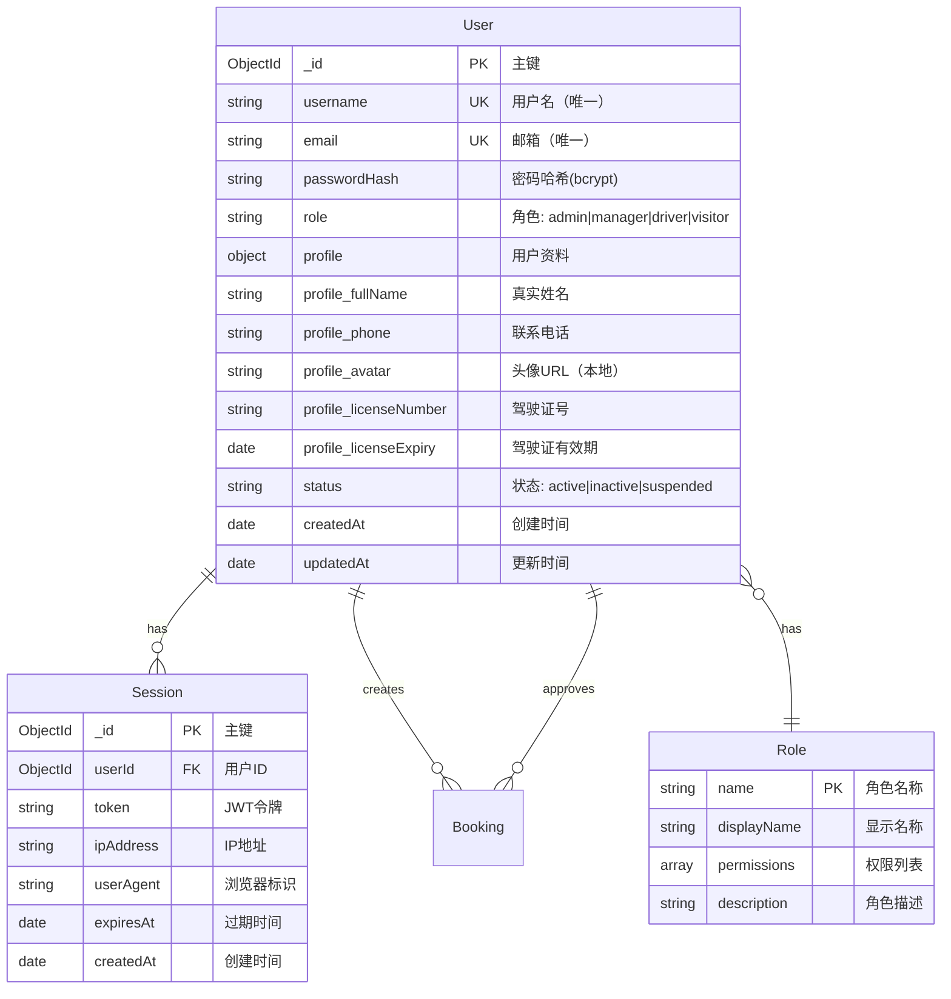
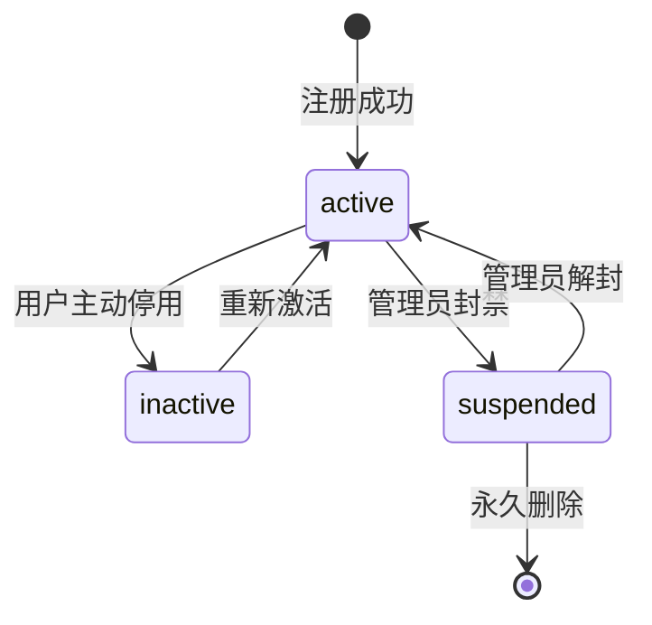

# 用户权限系统 ER 图 (User Permission System)

## 系统概述

用户权限系统负责管理用户身份认证、角色分配和访问控制，是整个 SmartTrack 系统的安全基础。

## 实体关系图



## 关系说明

### 1:N 关系

- **User → Session (1:N)**
  - 一个用户可以有多个活跃会话（多设备登录）
  - 外键：`Session.userId` → `User._id`
  
- **User → Booking (1:N) - 创建者**
  - 一个用户可以创建多个预约
  - 外键：`Booking.userId` → `User._id`
  
- **User → Booking (1:N) - 审批者**
  - 一个用户（管理员/调度员）可以审批多个预约
  - 外键：`Booking.approval.approvedBy` → `User._id`

### N:1 关系

- **User → Role (N:1)**
  - 多个用户可以属于同一角色
  - 字段：`User.role` 枚举类型关联到角色定义

## 核心字段说明

### User 核心字段

| 字段名 | 类型 | 必填 | 索引 | 说明 |
|--------|------|------|------|------|
| `_id` | ObjectId | ✅ | PK | 用户唯一标识 |
| `username` | string | ✅ | UK | 用户名，用于登录和显示 |
| `email` | string | ✅ | UK | 邮箱地址，登录凭证 |
| `passwordHash` | string | ✅ | - | bcrypt 加密后的密码（12轮加盐） |
| `role` | enum | ✅ | 组合索引 | 角色：admin/manager/driver/visitor |
| `profile.fullName` | string | ✅ | - | 用户真实姓名 |
| `profile.licenseNumber` | string | driver需要 | - | 驾驶证号码（仅驾驶员） |
| `profile.licenseExpiry` | Date | driver需要 | - | 驾驶证有效期 |
| `status` | enum | ✅ | 组合索引 | 账号状态：active/inactive/suspended |

### 索引策略

```typescript
// 唯一索引
User.index({ username: 1 }, { unique: true });
User.index({ email: 1 }, { unique: true });

// 组合索引 - 用于角色过滤查询
User.index({ role: 1, status: 1 });

// Session 索引
Session.index({ userId: 1 });
Session.index({ expiresAt: 1 }, { expireAfterSeconds: 0 }); // TTL索引自动清理过期会话
```

## 权限矩阵 (RBAC)

### 角色定义

| 角色 | 英文名 | 权限范围 |
|------|--------|---------|
| 系统管理员 | admin | 全局权限（用户管理、系统配置、数据导出） |
| 调度经理 | manager | 预约管理、车辆调度、场地分配、审批预约 |
| 试车员 | driver | 查看个人任务、更新预约状态、提交反馈 |
| 访客 | visitor | 仅查看公开信息，无法创建预约 |

### 权限示例

```typescript
const PERMISSIONS = {
  admin: ['*'], // 所有权限
  manager: [
    'booking:create',
    'booking:update',
    'booking:approve',
    'booking:delete',
    'vehicle:assign',
    'venue:manage',
    'user:view'
  ],
  driver: [
    'booking:view_own',
    'booking:update_status',
    'task:view',
    'feedback:submit'
  ],
  visitor: [
    'venue:view',
    'vehicle:view'
  ]
};
```

## 安全考虑

### 密码安全
- 使用 bcryptjs 加密，加盐轮数：12
- 密码强度要求：至少 8 位，包含大小写字母和数字
- 密码哈希存储在 `passwordHash` 字段，原始密码永不保存

### 会话安全
- JWT 令牌有效期：30 天
- 使用 `NEXTAUTH_SECRET` 环境变量签名
- 支持会话撤销（删除 Session 记录即可强制退出）

### 防护措施
- 登录失败限流（防止暴力破解）
- CSRF 令牌保护（NextAuth 内置）
- XSS 防护：用户输入严格校验和转义
- 账号锁定：连续失败 5 次后暂时禁用（status → suspended）

## 业务规则

### 用户注册规则
1. 邮箱和用户名必须全局唯一
2. 新注册用户默认角色为 `visitor`
3. 驾驶员角色需要提供驾驶证信息
4. 管理员可以通过后台直接创建任意角色用户

### 角色升级规则
1. `visitor` → `driver`：需上传驾驶证并通过审核
2. `driver` → `manager`：需管理员手动分配
3. `manager` → `admin`：需超级管理员授权

### 账号状态转换


## 使用示例

### 检查用户权限
```typescript
// lib/auth/permissions.ts
export function hasPermission(userRole: string, permission: string): boolean {
  const rolePermissions = PERMISSIONS[userRole] || [];
  return rolePermissions.includes('*') || rolePermissions.includes(permission);
}

// 使用示例
const canApproveBooking = hasPermission(user.role, 'booking:approve');
```

### 中间件路由保护
```typescript
// middleware.ts
if (path.startsWith('/admin') && token?.role !== 'admin') {
  return NextResponse.redirect(new URL('/dashboard', req.url));
}

if (path.startsWith('/dashboard/bookings/create') && 
    !['admin', 'manager', 'driver'].includes(token?.role)) {
  return NextResponse.redirect(new URL('/unauthorized', req.url));
}
```

## 相关文档

- [认证模块设计](../auth_design.md)
- [API 接口规范](../../AI_DEVELOPMENT.md#api-规范)
- [NextAuth.js 配置](../../../lib/auth/auth.config.ts)
