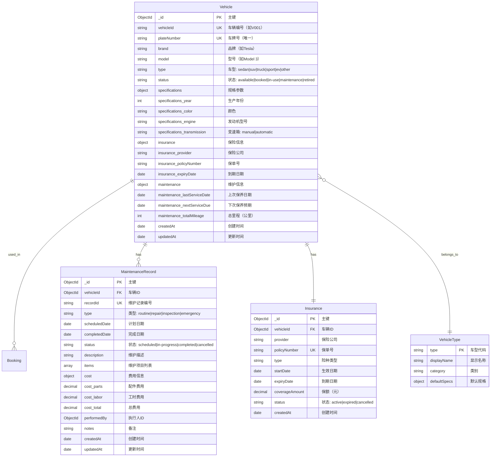

# 车辆系统 ER 图 (Vehicle System)

## 系统概述

车辆系统负责管理试车场的所有测试车辆，包括车辆信息、状态追踪、保险管理和维护记录。

## 实体关系图



## 关系说明

### 1:N 关系

- **Vehicle → Booking (1:N)**
  - 一辆车可以被预约多次（不同时间段）
  - 外键：`Booking.vehicleId` → `Vehicle._id`
  - 约束：同一车辆在同一时间段只能有一个有效预约

- **Vehicle → MaintenanceRecord (1:N)**
  - 一辆车有多条维护记录
  - 外键：`MaintenanceRecord.vehicleId` → `Vehicle._id`
  - 级联删除：车辆删除时保留历史记录（软删除）

### 1:1 关系

- **Vehicle → Insurance (1:1)**
  - 每辆车有一个当前有效的保险信息
  - 嵌入式文档：`Vehicle.insurance` 存储当前保险
  - 历史保险记录存储在独立的 Insurance 集合中

### N:1 关系

- **Vehicle → VehicleType (N:1)**
  - 多辆车可以属于同一车型
  - 字段：`Vehicle.type` 枚举类型关联到车型定义

## 核心字段说明

### Vehicle 核心字段

| 字段名 | 类型 | 必填 | 索引 | 说明 |
|--------|------|------|------|------|
| `_id` | ObjectId | ✅ | PK | 车辆唯一标识 |
| `vehicleId` | string | ✅ | UK | 车辆编号（如"V001"），系统内部使用 |
| `plateNumber` | string | ✅ | UK | 车牌号，唯一标识车辆 |
| `brand` | string | ✅ | - | 品牌名称（如"Tesla"） |
| `model` | string | ✅ | - | 型号（如"Model 3"） |
| `type` | enum | ✅ | 组合索引 | 车型分类 |
| `status` | enum | ✅ | 组合索引 | 车辆当前状态 |
| `specifications.year` | int | ✅ | - | 生产年份 |
| `insurance.expiryDate` | Date | ✅ | - | 保险到期日期（需定期检查） |
| `maintenance.totalMileage` | int | ✅ | - | 总行驶里程 |

### MaintenanceRecord 核心字段

| 字段名 | 类型 | 必填 | 说明 |
|--------|------|------|------|
| `_id` | ObjectId | ✅ | 记录唯一标识 |
| `recordId` | string | ✅ | 维护记录编号（如"MNT20260126001"） |
| `vehicleId` | ObjectId | ✅ | 关联的车辆ID |
| `type` | enum | ✅ | routine(例行)/repair(维修)/inspection(检查)/emergency(紧急) |
| `scheduledDate` | Date | ✅ | 计划维护日期 |
| `completedDate` | Date | ❌ | 实际完成日期 |
| `cost.total` | decimal | ❌ | 维护总费用 |

### 索引策略

```typescript
// 车辆唯一索引
Vehicle.index({ vehicleId: 1 }, { unique: true });
Vehicle.index({ plateNumber: 1 }, { unique: true });

// 车辆状态查询索引
Vehicle.index({ status: 1 });
Vehicle.index({ type: 1, status: 1 }); // 查询可用的特定车型

// 维护记录索引
MaintenanceRecord.index({ vehicleId: 1, scheduledDate: -1 }); // 按车辆查询最近维护
MaintenanceRecord.index({ status: 1, scheduledDate: 1 }); // 查询待执行的维护任务

// 保险到期提醒索引
Vehicle.index({ 'insurance.expiryDate': 1 }); // 查询即将到期的保险
```

## 状态机定义

### 车辆状态流转

```mermaid
stateDiagram-v2
    [*] --> available: 车辆入库
    available --> booked: 创建预约(BOOK)
    booked --> in-use: 开始使用(START)
    booked --> available: 取消预约(CANCEL)
    in-use --> available: 使用完成(COMPLETE)
    in-use --> maintenance: 发现故障(REPORT_ISSUE)
    available --> maintenance: 计划维护(SCHEDULE_MAINTENANCE)
    maintenance --> available: 维护完成(COMPLETE_MAINTENANCE)
    available --> retired: 报废(RETIRE)
    retired --> [*]
    
    note right of maintenance
        维护期间车辆不可预约
        需等待维护完成
    end note
```

### 维护记录状态流转

```mermaid
stateDiagram-v2
    [*] --> scheduled: 创建维护计划
    scheduled --> in-progress: 开始维护(START)
    scheduled --> cancelled: 取消维护(CANCEL)
    in-progress --> completed: 完成维护(COMPLETE)
    cancelled --> [*]
    completed --> [*]
```

## 业务规则

### 车辆可用性规则

使用 Zen Engine 配置的资格校验规则：

```json
{
  "contentType": "application/vnd.gorules.decision",
  "nodes": [
    {
      "id": "input",
      "type": "inputNode",
      "content": {
        "fields": [
          { "name": "vehicleStatus", "type": "string" },
          { "name": "insuranceExpiryDate", "type": "date" },
          { "name": "lastServiceDate", "type": "date" },
          { "name": "totalMileage", "type": "number" }
        ]
      }
    },
    {
      "id": "availability-check",
      "type": "decisionTableNode",
      "content": {
        "rules": [
          {
            "condition": "vehicleStatus != 'available'",
            "result": {
              "isAvailable": false,
              "reason": "车辆当前不可用（状态：{{vehicleStatus}}）"
            }
          },
          {
            "condition": "insuranceExpiryDate < today()",
            "result": {
              "isAvailable": false,
              "reason": "车辆保险已过期，需更新保险"
            }
          },
          {
            "condition": "daysBetween(lastServiceDate, today()) > 180",
            "result": {
              "isAvailable": false,
              "reason": "车辆超过6个月未保养，需进行例行检查"
            }
          },
          {
            "condition": "totalMileage > 200000",
            "result": {
              "isAvailable": false,
              "reason": "车辆里程超过20万公里，需大保养"
            }
          },
          {
            "condition": "true",
            "result": {
              "isAvailable": true,
              "reason": "车辆可用"
            }
          }
        ]
      }
    }
  ]
}
```

### 保养提醒规则

1. **例行保养**：每 5000 公里或 6 个月，以先到者为准
2. **大保养**：每 20000 公里或 2 年
3. **保险提醒**：到期前 30 天发送通知
4. **年检提醒**：到期前 60 天发送通知

### 车辆预约冲突检测

```typescript
// lib/db/services/vehicle.service.ts
export class VehicleService {
  /**
   * 检查车辆在指定时间段是否可用
   */
  static async checkAvailability(
    vehicleId: string,
    startTime: Date,
    endTime: Date
  ): Promise<{ available: boolean; reason?: string }> {
    // 1. 检查车辆状态
    const vehicle = await Vehicle.findOne({ vehicleId });
    if (vehicle.status !== 'available') {
      return {
        available: false,
        reason: `车辆当前状态为 ${vehicle.status}，不可预约`,
      };
    }

    // 2. 检查时间段冲突
    const conflictBooking = await Booking.findOne({
      vehicleId: vehicle._id,
      status: { $in: ['confirmed', 'in-progress'] },
      $or: [
        {
          'schedule.startTime': { $lt: endTime },
          'schedule.endTime': { $gt: startTime },
        },
      ],
    });

    if (conflictBooking) {
      return {
        available: false,
        reason: `车辆在该时间段已被预约（预约号：${conflictBooking.bookingId}）`,
      };
    }

    // 3. 检查保险有效性
    if (vehicle.insurance.expiryDate < new Date()) {
      return {
        available: false,
        reason: '车辆保险已过期，请联系管理员更新保险信息',
      };
    }

    return { available: true };
  }
}
```

## 使用示例

### 查询可用车辆

```typescript
// 获取所有可用的 SUV
const availableSUVs = await Vehicle.find({
  type: 'suv',
  status: 'available',
  'insurance.expiryDate': { $gte: new Date() },
});

// 按品牌和年份筛选
const recentTeslas = await Vehicle.find({
  brand: 'Tesla',
  'specifications.year': { $gte: 2020 },
  status: { $in: ['available', 'booked'] },
});
```

### 创建维护记录

```typescript
const maintenanceRecord = await MaintenanceRecord.create({
  recordId: generateMaintenanceId(), // "MNT20260126001"
  vehicleId: vehicle._id,
  type: 'routine',
  scheduledDate: new Date('2026-02-01'),
  description: '例行保养：更换机油、机滤、空滤',
  items: ['机油更换', '机滤更换', '空滤更换', '轮胎检查'],
  cost: {
    parts: 800,
    labor: 300,
    total: 1100,
  },
  status: 'scheduled',
});

// 更新车辆状态为维护中
await Vehicle.findByIdAndUpdate(vehicle._id, {
  status: 'maintenance',
  'maintenance.lastServiceDate': new Date(),
});
```

### 保险到期提醒

```typescript
// 查询30天内即将到期的保险
const expiringInsurances = await Vehicle.find({
  'insurance.expiryDate': {
    $gte: new Date(),
    $lte: addDays(new Date(), 30),
  },
  status: { $ne: 'retired' },
});

// 发送提醒通知
for (const vehicle of expiringInsurances) {
  await sendNotification({
    type: 'insurance_expiry_warning',
    vehicleId: vehicle.vehicleId,
    plateNumber: vehicle.plateNumber,
    expiryDate: vehicle.insurance.expiryDate,
  });
}
```

## 数据完整性约束

### 数据库层约束

```typescript
// lib/db/models/Vehicle.ts
const VehicleSchema = new Schema({
  vehicleId: {
    type: String,
    required: true,
    unique: true,
    match: /^V\d{3,}$/, // 格式：V001, V002, ...
  },
  plateNumber: {
    type: String,
    required: true,
    unique: true,
    match: /^[京津沪渝冀豫云辽黑湘皖鲁新苏浙赣鄂桂甘晋蒙陕吉闽贵粤青藏川宁琼使领][A-Z][A-HJ-NP-Z0-9]{5}$/, // 中国车牌号格式
  },
  'insurance.expiryDate': {
    type: Date,
    required: true,
    validate: {
      validator: (v: Date) => v > new Date(),
      message: '保险到期日期不能早于当前日期',
    },
  },
  'maintenance.totalMileage': {
    type: Number,
    required: true,
    min: 0,
    default: 0,
  },
});

// 保存前钩子：检查保险有效性
VehicleSchema.pre('save', function (next) {
  if (this.status === 'available' && this.insurance.expiryDate < new Date()) {
    this.status = 'maintenance';
    next(new Error('保险已过期，车辆已自动转为维护状态'));
  }
  next();
});
```

## 性能优化建议

1. **复合索引优化**：
   - 查询可用车辆时使用 `{ type: 1, status: 1 }` 复合索引
   - 避免使用 `$where` 和 `$expr` 降低查询效率

2. **缓存策略**：
   - 车辆基本信息（品牌、型号）缓存 1 小时
   - 车辆状态信息（status）缓存 5 分钟
   - 使用 Redis 缓存热门车辆数据

3. **分页查询**：
   - 车辆列表使用游标分页（Cursor Pagination）
   - 单页最大返回 50 条记录

## 相关文档

- [核心数据模型](../../AI_DEVELOPMENT.md#2-核心数据模型-core-data-models)
- [车辆状态机实现](../../../lib/state-machines/vehicle.machine.ts)
- [维护服务层](../../../lib/db/services/vehicle.service.ts)
