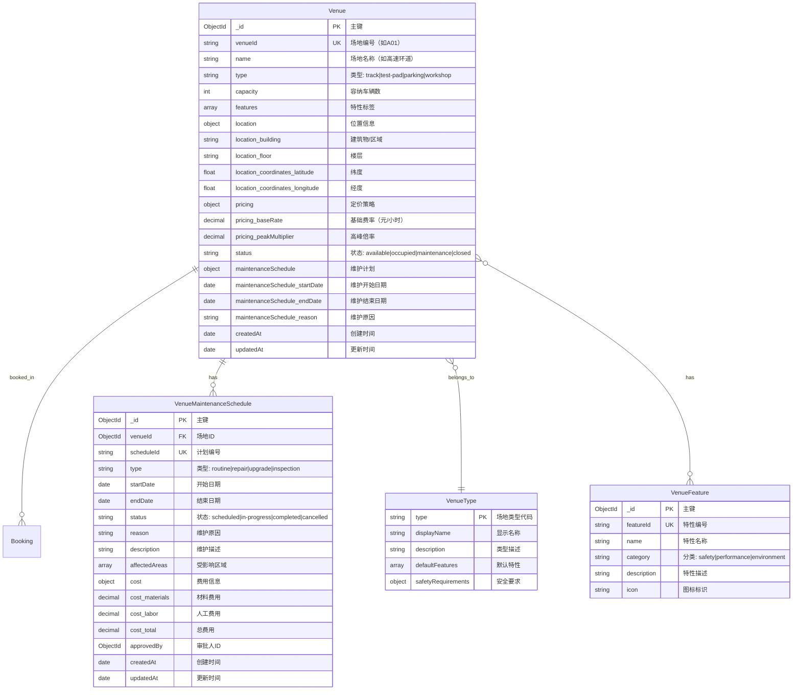

# 场地系统 ER 图 (Venue System)

## 系统概述

场地系统负责管理试车场的各类测试场地，包括场地信息、容量管理、定价策略和维护计划。

## 实体关系图



## 关系说明

### 1:N 关系

- **Venue → Booking (1:N)**
  - 一个场地可以有多个预约（不同时间段）
  - 外键：`Booking.venueId` → `Venue._id`
  - 约束：场地容量限制，同一时间段预约数不超过 `capacity`

- **Venue → VenueMaintenanceSchedule (1:N)**
  - 一个场地可以有多个维护计划记录
  - 外键：`VenueMaintenanceSchedule.venueId` → `Venue._id`
  - 级联：维护期间场地状态自动更新为 `maintenance`

### N:1 关系

- **Venue → VenueType (N:1)**
  - 多个场地可以属于同一类型
  - 字段：`Venue.type` 枚举类型关联到场地类型定义

### N:M 关系

- **Venue ↔ VenueFeature (N:M)**
  - 一个场地可以有多个特性（如高速测试、湿滑路面、噪音测试）
  - 一个特性可以被多个场地拥有
  - 存储方式：`Venue.features` 数组存储特性名称列表

## 核心字段说明

### Venue 核心字段

| 字段名 | 类型 | 必填 | 索引 | 说明 |
|--------|------|------|------|------|
| `_id` | ObjectId | ✅ | PK | 场地唯一标识 |
| `venueId` | string | ✅ | UK | 场地编号（如"A01", "B02"） |
| `name` | string | ✅ | - | 场地名称（如"高速环道"） |
| `type` | enum | ✅ | 组合索引 | track(赛道)/test-pad(试验台)/parking(停车场)/workshop(车间) |
| `capacity` | int | ✅ | - | 同时容纳的最大车辆数 |
| `features` | array | ❌ | - | 特性标签（如["高速测试", "湿滑路面"]） |
| `status` | enum | ✅ | 组合索引 | available/occupied/maintenance/closed |
| `pricing.baseRate` | decimal | ✅ | - | 基础费率（元/小时） |
| `pricing.peakMultiplier` | decimal | ✅ | - | 高峰时段倍率（如1.5表示加价50%） |

### VenueMaintenanceSchedule 核心字段

| 字段名 | 类型 | 必填 | 说明 |
|--------|------|------|------|
| `_id` | ObjectId | ✅ | 记录唯一标识 |
| `scheduleId` | string | ✅ | 维护计划编号（如"VMS20260126001"） |
| `venueId` | ObjectId | ✅ | 关联的场地ID |
| `type` | enum | ✅ | routine(例行)/repair(维修)/upgrade(升级)/inspection(检查) |
| `startDate` | Date | ✅ | 维护开始日期 |
| `endDate` | Date | ✅ | 维护结束日期 |
| `status` | enum | ✅ | scheduled/in-progress/completed/cancelled |
| `approvedBy` | ObjectId | ✅ | 审批人（管理员）ID |

### 索引策略

```typescript
// 场地唯一索引
Venue.index({ venueId: 1 }, { unique: true });

// 场地状态查询索引
Venue.index({ status: 1 });
Venue.index({ type: 1, status: 1 }); // 查询可用的特定类型场地

// 特性查询索引
Venue.index({ features: 1 }); // 支持数组元素查询

// 维护计划索引
VenueMaintenanceSchedule.index({ venueId: 1, startDate: -1 }); // 按场地查询最近维护
VenueMaintenanceSchedule.index({ status: 1, startDate: 1 }); // 查询待执行的维护任务
```

## 状态机定义

### 场地状态流转


### 维护计划状态流转

```mermaid
stateDiagram-v2
    [*] --> scheduled: 创建维护计划
    scheduled --> in-progress: 开始维护(START)
    scheduled --> cancelled: 取消维护(CANCEL)
    in-progress --> completed: 完成维护(COMPLETE)
    cancelled --> [*]
    completed --> [*]
    
    note right of scheduled
        需要管理员审批
        审批后自动更新场地状态
    end note
```

## 业务规则

### 场地容量管理规则

使用 Zen Engine 配置的容量校验规则：

```json
{
  "contentType": "application/vnd.gorules.decision",
  "nodes": [
    {
      "id": "input",
      "type": "inputNode",
      "content": {
        "fields": [
          { "name": "venueId", "type": "string" },
          { "name": "venueCapacity", "type": "number" },
          { "name": "currentBookings", "type": "number" },
          { "name": "venueStatus", "type": "string" },
          { "name": "requestedStartTime", "type": "date" },
          { "name": "requestedEndTime", "type": "date" }
        ]
      }
    },
    {
      "id": "capacity-check",
      "type": "decisionTableNode",
      "content": {
        "rules": [
          {
            "condition": "venueStatus != 'available'",
            "result": {
              "isAvailable": false,
              "reason": "场地当前不可用（状态：{{venueStatus}}）"
            }
          },
          {
            "condition": "currentBookings >= venueCapacity",
            "result": {
              "isAvailable": false,
              "reason": "场地已达最大容量（{{currentBookings}}/{{venueCapacity}}）"
            }
          },
          {
            "condition": "true",
            "result": {
              "isAvailable": true,
              "availableSlots": "venueCapacity - currentBookings",
              "reason": "场地可用"
            }
          }
        ]
      }
    }
  ]
}
```

### 动态定价规则

使用 Zen Engine 配置的定价规则：

```json
{
  "contentType": "application/vnd.gorules.decision",
  "nodes": [
    {
      "id": "input",
      "type": "inputNode",
      "content": {
        "fields": [
          { "name": "venueType", "type": "string" },
          { "name": "baseRate", "type": "number" },
          { "name": "duration", "type": "number" },
          { "name": "isPeakHour", "type": "boolean" },
          { "name": "peakMultiplier", "type": "number" },
          { "name": "userLevel", "type": "string" }
        ]
      }
    },
    {
      "id": "base-fee-calculation",
      "type": "expressionNode",
      "content": {
        "expression": "baseRate * duration"
      }
    },
    {
      "id": "peak-adjustment",
      "type": "expressionNode",
      "content": {
        "expression": "isPeakHour ? baseFee * peakMultiplier : baseFee"
      }
    },
    {
      "id": "user-discount",
      "type": "decisionTableNode",
      "content": {
        "rules": [
          {
            "condition": "userLevel == 'VIP'",
            "result": { "discount": 0.2 }
          },
          {
            "condition": "userLevel == 'Gold'",
            "result": { "discount": 0.1 }
          },
          {
            "condition": "duration > 4",
            "result": { "discount": 0.15 }
          },
          {
            "condition": "true",
            "result": { "discount": 0 }
          }
        ]
      }
    },
    {
      "id": "final-fee",
      "type": "expressionNode",
      "content": {
        "expression": "adjustedFee * (1 - discount)"
      }
    }
  ]
}
```

### 场地预约冲突检测

```typescript
// lib/db/services/venue.service.ts
export class VenueService {
  /**
   * 检查场地在指定时间段的可用容量
   */
  static async checkCapacity(
    venueId: string,
    startTime: Date,
    endTime: Date
  ): Promise<{ available: boolean; capacity: number; used: number; reason?: string }> {
    // 1. 获取场地信息
    const venue = await Venue.findOne({ venueId });
    if (!venue) {
      return {
        available: false,
        capacity: 0,
        used: 0,
        reason: '场地不存在',
      };
    }

    // 2. 检查场地状态
    if (venue.status !== 'available') {
      return {
        available: false,
        capacity: venue.capacity,
        used: 0,
        reason: `场地当前状态为 ${venue.status}，不可预约`,
      };
    }

    // 3. 检查维护计划冲突
    if (venue.maintenanceSchedule) {
      const { startDate, endDate } = venue.maintenanceSchedule;
      if (startTime < endDate && endTime > startDate) {
        return {
          available: false,
          capacity: venue.capacity,
          used: 0,
          reason: `场地在该时间段计划维护（${startDate} 至 ${endDate}）`,
        };
      }
    }

    // 4. 统计时间段内的预约数
    const overlappingBookings = await Booking.countDocuments({
      venueId: venue._id,
      status: { $in: ['confirmed', 'in-progress'] },
      $or: [
        {
          'schedule.startTime': { $lt: endTime },
          'schedule.endTime': { $gt: startTime },
        },
      ],
    });

    // 5. 判断容量
    const availableSlots = venue.capacity - overlappingBookings;
    if (availableSlots <= 0) {
      return {
        available: false,
        capacity: venue.capacity,
        used: overlappingBookings,
        reason: `场地已达最大容量（${overlappingBookings}/${venue.capacity}）`,
      };
    }

    return {
      available: true,
      capacity: venue.capacity,
      used: overlappingBookings,
    };
  }

  /**
   * 计算场地费用
   */
  static async calculateFee(
    venueId: string,
    duration: number,
    startTime: Date,
    userLevel: string = 'Regular'
  ): Promise<{ baseFee: number; finalFee: number; discount: number }> {
    const venue = await Venue.findOne({ venueId });
    const isPeakHour = this.isPeakHour(startTime);

    // 使用 Zen Engine 计算费用
    const engine = new ZenEngine();
    const decision = engine.createDecision(venuePricingRules);
    const result = await decision.evaluate({
      venueType: venue.type,
      baseRate: venue.pricing.baseRate,
      duration,
      isPeakHour,
      peakMultiplier: venue.pricing.peakMultiplier,
      userLevel,
    });

    return result;
  }

  /**
   * 判断是否为高峰时段
   */
  private static isPeakHour(time: Date): boolean {
    const hour = time.getHours();
    const dayOfWeek = time.getDay();

    // 工作日 9:00-18:00 为高峰时段
    return dayOfWeek >= 1 && dayOfWeek <= 5 && hour >= 9 && hour < 18;
  }
}
```

## 使用示例

### 查询可用场地

```typescript
// 获取所有可用的赛道类型场地
const availableTracks = await Venue.find({
  type: 'track',
  status: 'available',
});

// 按特性筛选场地
const wetTestVenues = await Venue.find({
  features: { $in: ['湿滑路面', '积水测试'] },
  status: 'available',
});

// 查询高速测试场地
const highSpeedVenues = await Venue.find({
  name: { $regex: /高速/i },
  status: 'available',
});
```

### 创建维护计划

```typescript
const maintenanceSchedule = await VenueMaintenanceSchedule.create({
  scheduleId: generateScheduleId(), // "VMS20260126001"
  venueId: venue._id,
  type: 'routine',
  startDate: new Date('2026-02-01'),
  endDate: new Date('2026-02-03'),
  status: 'scheduled',
  reason: '例行场地保养',
  description: '清洁路面、检查安全设施、更换磨损部件',
  affectedAreas: ['主赛道', '缓冲区', '观测台'],
  cost: {
    materials: 5000,
    labor: 3000,
    total: 8000,
  },
  approvedBy: adminUserId,
});

// 更新场地状态
await Venue.findByIdAndUpdate(venue._id, {
  status: 'maintenance',
  maintenanceSchedule: {
    startDate: new Date('2026-02-01'),
    endDate: new Date('2026-02-03'),
    reason: '例行场地保养',
  },
});

// 通知已有预约用户
const affectedBookings = await Booking.find({
  venueId: venue._id,
  'schedule.startTime': {
    $gte: new Date('2026-02-01'),
    $lte: new Date('2026-02-03'),
  },
  status: { $in: ['pending', 'confirmed'] },
});

for (const booking of affectedBookings) {
  await sendNotification({
    type: 'venue_maintenance_notification',
    bookingId: booking.bookingId,
    userId: booking.userId,
    message: `您的预约场地将进行维护，请重新选择场地或时间`,
  });
}
```

### 场地使用率统计

```typescript
// 统计场地在指定日期范围内的使用率
async function calculateVenueUtilization(
  venueId: string,
  startDate: Date,
  endDate: Date
): Promise<{ utilizationRate: number; totalHours: number; bookedHours: number }> {
  const venue = await Venue.findOne({ venueId });
  
  // 计算总可用小时数（假设每天 8:00-20:00 营业）
  const dayCount = Math.ceil((endDate.getTime() - startDate.getTime()) / (1000 * 60 * 60 * 24));
  const totalHours = dayCount * 12 * venue.capacity; // 12小时 * 容量

  // 统计实际预约小时数
  const bookings = await Booking.find({
    venueId: venue._id,
    status: { $in: ['confirmed', 'in-progress', 'completed'] },
    'schedule.startTime': { $gte: startDate, $lte: endDate },
  });

  const bookedHours = bookings.reduce((sum, booking) => {
    return sum + booking.schedule.duration;
  }, 0);

  const utilizationRate = (bookedHours / totalHours) * 100;

  return {
    utilizationRate: Math.round(utilizationRate * 100) / 100,
    totalHours,
    bookedHours,
  };
}

// 使用示例
const utilization = await calculateVenueUtilization(
  'A01',
  new Date('2026-01-01'),
  new Date('2026-01-31')
);
console.log(`场地使用率：${utilization.utilizationRate}%`);
```

## 数据完整性约束

### 数据库层约束

```typescript
// lib/db/models/Venue.ts
const VenueSchema = new Schema({
  venueId: {
    type: String,
    required: true,
    unique: true,
    match: /^[A-Z]\d{2}$/, // 格式：A01, B02, C03, ...
  },
  name: {
    type: String,
    required: true,
    trim: true,
    minlength: 2,
    maxlength: 50,
  },
  capacity: {
    type: Number,
    required: true,
    min: 1,
    max: 100,
  },
  'pricing.baseRate': {
    type: Number,
    required: true,
    min: 0,
  },
  'pricing.peakMultiplier': {
    type: Number,
    required: true,
    min: 1.0,
    max: 3.0,
    default: 1.5,
  },
});

// 保存前钩子：检查维护计划有效性
VenueSchema.pre('save', function (next) {
  if (this.maintenanceSchedule) {
    const { startDate, endDate } = this.maintenanceSchedule;
    if (endDate <= startDate) {
      return next(new Error('维护结束时间必须晚于开始时间'));
    }
    if (startDate < new Date()) {
      return next(new Error('维护开始时间不能早于当前时间'));
    }
  }
  next();
});
```

## 性能优化建议

1. **复合索引优化**：
   - 查询可用场地时使用 `{ type: 1, status: 1 }` 复合索引
   - 容量查询使用 `{ venueId: 1, status: 1 }` 索引

2. **缓存策略**：
   - 场地基本信息（名称、容量、定价）缓存 1 小时
   - 场地状态信息缓存 5 分钟
   - 使用 Redis 缓存热门场地数据

3. **聚合查询优化**：
   - 使用 MongoDB 聚合管道统计场地使用率
   - 定期预计算统计数据，存储在独立集合中

## 相关文档

- [核心数据模型](../../AI_DEVELOPMENT.md#2-核心数据模型-core-data-models)
- [场地服务层](../../../lib/db/services/venue.service.ts)
- [定价规则配置](../../../lib/rules/venue-pricing.rules.json)
