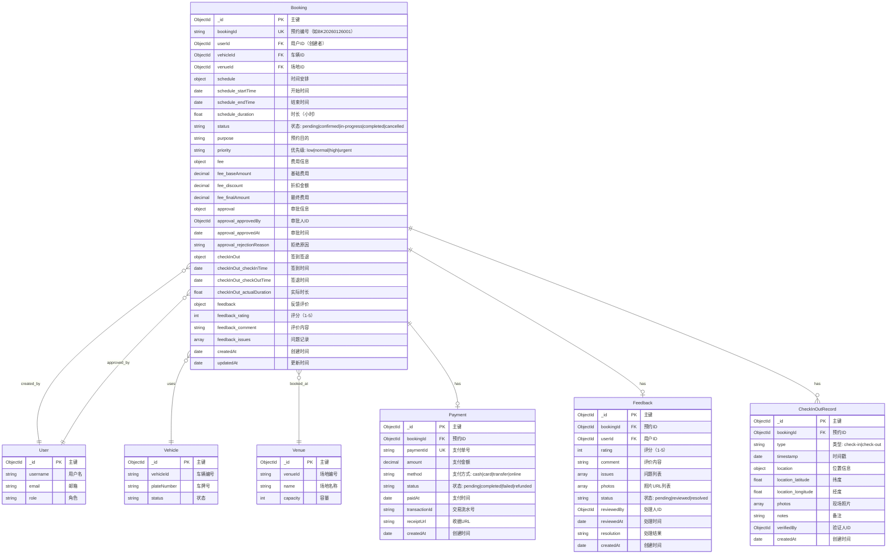
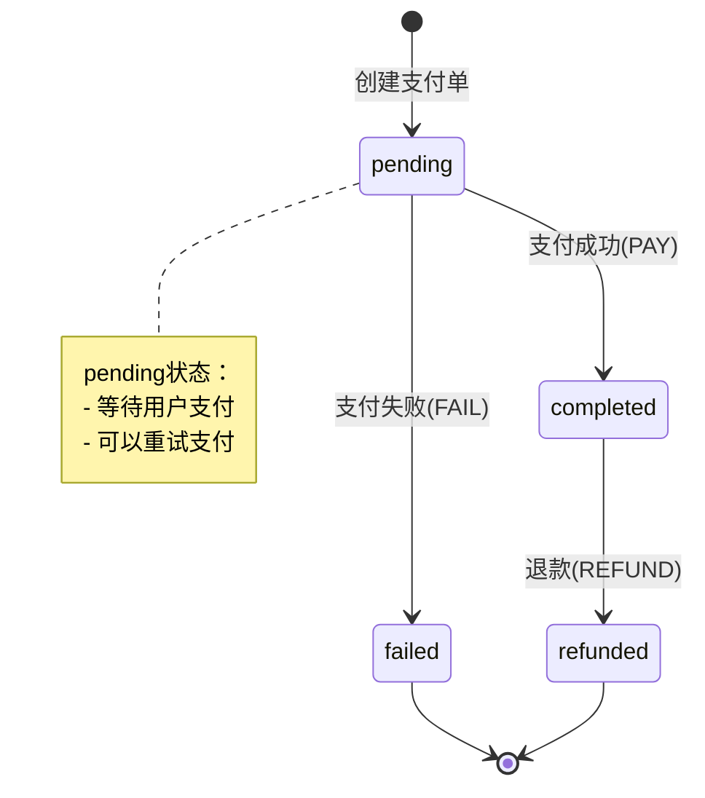

# 预约系统 ER 图 (Booking System)

## 系统概述

预约系统是 SmartTrack 的核心业务模块，负责管理车辆试车预约的全生命周期，包括预约创建、审批流程、执行跟踪和费用结算。

## 实体关系图



## 关系说明

### N:1 关系

- **Booking → User (N:1) - 创建者**
  - 多个预约可以由同一用户创建
  - 外键：`Booking.userId` → `User._id`
  - 必填字段，不能为空

- **Booking → User (N:1) - 审批者**
  - 多个预约可以由同一审批人审批
  - 外键：`Booking.approval.approvedBy` → `User._id`
  - 可选字段，仅在审批后填充

- **Booking → Vehicle (N:1)**
  - 多个预约（不同时间）可以使用同一车辆
  - 外键：`Booking.vehicleId` → `Vehicle._id`
  - 约束：同一车辆在同一时间段只能有一个有效预约

- **Booking → Venue (N:1)**
  - 多个预约可以在同一场地（受容量限制）
  - 外键：`Booking.venueId` → `Venue._id`
  - 约束：场地容量限制，同一时间段预约数不超过 `venue.capacity`

### 1:1 关系

- **Booking → Payment (1:1)**
  - 每个预约有一个支付记录（完成后）
  - 外键：`Payment.bookingId` → `Booking._id`
  - 可选：免费预约或预付款可以没有支付记录

- **Booking → Feedback (1:1)**
  - 每个预约可以有一条反馈记录（完成后）
  - 外键：`Feedback.bookingId` → `Booking._id`
  - 可选：用户可以选择不提交反馈

### 1:N 关系

- **Booking → CheckInOutRecord (1:N)**
  - 一个预约可以有多条签到/签退记录（签到1次 + 签退1次）
  - 外键：`CheckInOutRecord.bookingId` → `Booking._id`
  - 级联删除：预约删除时同步删除签到记录

## 核心字段说明

### Booking 核心字段

| 字段名 | 类型 | 必填 | 索引 | 说明 |
|--------|------|------|------|------|
| `_id` | ObjectId | ✅ | PK | 预约唯一标识 |
| `bookingId` | string | ✅ | UK | 预约编号（如"BK20260126001"） |
| `userId` | ObjectId | ✅ | 组合索引 | 创建预约的用户ID |
| `vehicleId` | ObjectId | ✅ | 组合索引 | 预约的车辆ID |
| `venueId` | ObjectId | ✅ | 组合索引 | 预约的场地ID |
| `schedule.startTime` | Date | ✅ | 组合索引 | 预约开始时间 |
| `schedule.endTime` | Date | ✅ | - | 预约结束时间 |
| `schedule.duration` | float | ✅ | - | 预约时长（小时） |
| `status` | enum | ✅ | 组合索引 | 预约状态 |
| `purpose` | string | ✅ | - | 预约目的说明 |
| `priority` | enum | ✅ | - | 优先级 |
| `fee.finalAmount` | decimal | ✅ | - | 最终应付费用 |
| `approval.approvedBy` | ObjectId | ❌ | - | 审批人ID（审批后填充） |

### Payment 核心字段

| 字段名 | 类型 | 必填 | 说明 |
|--------|------|------|------|
| `_id` | ObjectId | ✅ | 支付记录唯一标识 |
| `paymentId` | string | ✅ | 支付单号（如"PAY20260126001"） |
| `bookingId` | ObjectId | ✅ | 关联的预约ID |
| `amount` | decimal | ✅ | 支付金额 |
| `method` | enum | ✅ | 支付方式：cash/card/transfer/online |
| `status` | enum | ✅ | 支付状态：pending/completed/failed/refunded |
| `paidAt` | Date | ❌ | 支付完成时间 |

### Feedback 核心字段

| 字段名 | 类型 | 必填 | 说明 |
|--------|------|------|------|
| `_id` | ObjectId | ✅ | 反馈记录唯一标识 |
| `bookingId` | ObjectId | ✅ | 关联的预约ID |
| `userId` | ObjectId | ✅ | 提交反馈的用户ID |
| `rating` | int | ✅ | 评分（1-5星） |
| `comment` | string | ❌ | 文字评价 |
| `issues` | array | ❌ | 问题列表（如["车辆异响", "场地积水"]） |
| `photos` | array | ❌ | 照片URL列表 |

### 索引策略

```typescript
// 预约唯一索引
Booking.index({ bookingId: 1 }, { unique: true });

// 用户预约历史查询
Booking.index({ userId: 1, status: 1 });
Booking.index({ userId: 1, 'schedule.startTime': -1 }); // 按时间倒序

// 车辆占用检查（时间冲突检测）
Booking.index({ vehicleId: 1, 'schedule.startTime': 1 });
Booking.index({ vehicleId: 1, status: 1, 'schedule.startTime': 1 });

// 场地占用检查（容量管理）
Booking.index({ venueId: 1, 'schedule.startTime': 1 });
Booking.index({ venueId: 1, status: 1, 'schedule.startTime': 1 });

// 状态过滤查询
Booking.index({ status: 1, 'schedule.startTime': 1 });

// 审批查询
Booking.index({ 'approval.approvedBy': 1, 'approval.approvedAt': -1 });

// 支付查询
Payment.index({ bookingId: 1 });
Payment.index({ status: 1, paidAt: -1 });

// 反馈查询
Feedback.index({ bookingId: 1 }, { unique: true });
Feedback.index({ status: 1, createdAt: -1 });
```

## 状态机定义

### 预约状态流转

```mermaid
stateDiagram-v2
    [*] --> pending: 创建预约(CREATE)
    pending --> confirmed: 审批通过(APPROVE)
    pending --> cancelled: 审批拒绝/用户取消(REJECT/CANCEL)
    confirmed --> in-progress: 签到开始(CHECK_IN)
    confirmed --> cancelled: 用户取消(CANCEL)
    in-progress --> completed: 签退完成(CHECK_OUT)
    cancelled --> [*]
    completed --> [*]
    
    note right of pending
        pending状态：
        - 等待管理员审批
        - 用户可以取消
        - 可以修改预约信息
    end note
    
    note right of confirmed
        confirmed状态：
        - 审批通过，资源锁定
        - 用户仍可取消（可能收取费用）
        - 不能修改关键信息
    end note
    
    note right of in-progress
        in-progress状态：
        - 正在执行中
        - 不能取消
        - 记录实际使用时长
    end note
    
    note right of completed
        completed状态：
        - 已完成，可以评价
        - 触发费用结算
        - 释放资源
    end note
```

### 支付状态流转



## 业务规则

### 预约准入规则

使用 Zen Engine 配置的准入校验规则：

```json
{
  "contentType": "application/vnd.gorules.decision",
  "nodes": [
    {
      "id": "input",
      "type": "inputNode",
      "content": {
        "fields": [
          { "name": "userRole", "type": "string" },
          { "name": "hasValidLicense", "type": "boolean" },
          { "name": "vehicleStatus", "type": "string" },
          { "name": "venueStatus", "type": "string" },
          { "name": "venueCapacity", "type": "number" },
          { "name": "currentBookings", "type": "number" },
          { "name": "insuranceValid", "type": "boolean" }
        ]
      }
    },
    {
      "id": "user-eligibility",
      "type": "decisionTableNode",
      "content": {
        "rules": [
          {
            "condition": "userRole == 'visitor'",
            "result": {
              "eligible": false,
              "reason": "访客无预约权限，需升级为驾驶员"
            }
          },
          {
            "condition": "userRole == 'driver' && !hasValidLicense",
            "result": {
              "eligible": false,
              "reason": "驾驶证未验证或已过期，请更新驾驶证信息"
            }
          },
          {
            "condition": "userRole == 'driver' || userRole == 'manager' || userRole == 'admin'",
            "result": {
              "eligible": true
            }
          }
        ]
      }
    },
    {
      "id": "resource-availability",
      "type": "decisionTableNode",
      "content": {
        "rules": [
          {
            "condition": "vehicleStatus != 'available'",
            "result": {
              "available": false,
              "reason": "车辆当前不可用（状态：{{vehicleStatus}}）"
            }
          },
          {
            "condition": "!insuranceValid",
            "result": {
              "available": false,
              "reason": "车辆保险已过期或无效"
            }
          },
          {
            "condition": "venueStatus != 'available'",
            "result": {
              "available": false,
              "reason": "场地当前不可用（状态：{{venueStatus}}）"
            }
          },
          {
            "condition": "currentBookings >= venueCapacity",
            "result": {
              "available": false,
              "reason": "场地已达最大容量（{{currentBookings}}/{{venueCapacity}}）"
            }
          },
          {
            "condition": "true",
            "result": {
              "available": true
            }
          }
        ]
      }
    }
  ]
}
```

### 费用计算规则

使用 Zen Engine 配置的费用计算规则（整合车辆和场地定价）：

```json
{
  "contentType": "application/vnd.gorules.decision",
  "nodes": [
    {
      "id": "input",
      "type": "inputNode",
      "content": {
        "fields": [
          { "name": "vehicleType", "type": "string" },
          { "name": "venueBaseRate", "type": "number" },
          { "name": "duration", "type": "number" },
          { "name": "isPeakHour", "type": "boolean" },
          { "name": "peakMultiplier", "type": "number" },
          { "name": "userLevel", "type": "string" },
          { "name": "priority", "type": "string" }
        ]
      }
    },
    {
      "id": "base-fee",
      "type": "expressionNode",
      "content": {
        "expression": "venueBaseRate * duration"
      }
    },
    {
      "id": "vehicle-surcharge",
      "type": "decisionTableNode",
      "content": {
        "rules": [
          {
            "condition": "vehicleType == 'sport'",
            "result": { "surcharge": 200 }
          },
          {
            "condition": "vehicleType == 'ev'",
            "result": { "surcharge": 100 }
          },
          {
            "condition": "vehicleType == 'suv' || vehicleType == 'truck'",
            "result": { "surcharge": 150 }
          },
          {
            "condition": "true",
            "result": { "surcharge": 0 }
          }
        ]
      }
    },
    {
      "id": "peak-adjustment",
      "type": "expressionNode",
      "content": {
        "expression": "isPeakHour ? (baseFee + surcharge) * peakMultiplier : (baseFee + surcharge)"
      }
    },
    {
      "id": "user-discount",
      "type": "decisionTableNode",
      "content": {
        "rules": [
          {
            "condition": "userLevel == 'VIP'",
            "result": { "discount": 0.2 }
          },
          {
            "condition": "userLevel == 'Gold'",
            "result": { "discount": 0.1 }
          },
          {
            "condition": "duration > 4",
            "result": { "discount": 0.15 }
          },
          {
            "condition": "true",
            "result": { "discount": 0 }
          }
        ]
      }
    },
    {
      "id": "priority-surcharge",
      "type": "decisionTableNode",
      "content": {
        "rules": [
          {
            "condition": "priority == 'urgent'",
            "result": { "prioritySurcharge": 300 }
          },
          {
            "condition": "priority == 'high'",
            "result": { "prioritySurcharge": 150 }
          },
          {
            "condition": "true",
            "result": { "prioritySurcharge": 0 }
          }
        ]
      }
    },
    {
      "id": "final-fee",
      "type": "expressionNode",
      "content": {
        "expression": "(adjustedFee * (1 - discount)) + prioritySurcharge"
      }
    }
  ]
}
```

### 时间冲突检测

```typescript
// lib/db/services/booking.service.ts
export class BookingService {
  /**
   * 检查预约时间冲突
   */
  static async checkTimeConflict(
    vehicleId: string,
    venueId: string,
    startTime: Date,
    endTime: Date,
    excludeBookingId?: string
  ): Promise<{ hasConflict: boolean; conflictingBooking?: IBooking; reason?: string }> {
    // 1. 检查车辆冲突
    const vehicleConflict = await Booking.findOne({
      _id: { $ne: excludeBookingId },
      vehicleId,
      status: { $in: ['confirmed', 'in-progress'] },
      $or: [
        {
          'schedule.startTime': { $lt: endTime },
          'schedule.endTime': { $gt: startTime },
        },
      ],
    });

    if (vehicleConflict) {
      return {
        hasConflict: true,
        conflictingBooking: vehicleConflict,
        reason: `车辆在该时间段已被预约（预约号：${vehicleConflict.bookingId}）`,
      };
    }

    // 2. 检查场地容量
    const venueBookingsCount = await Booking.countDocuments({
      _id: { $ne: excludeBookingId },
      venueId,
      status: { $in: ['confirmed', 'in-progress'] },
      $or: [
        {
          'schedule.startTime': { $lt: endTime },
          'schedule.endTime': { $gt: startTime },
        },
      ],
    });

    const venue = await Venue.findById(venueId);
    if (venueBookingsCount >= venue.capacity) {
      return {
        hasConflict: true,
        reason: `场地在该时间段已达最大容量（${venueBookingsCount}/${venue.capacity}）`,
      };
    }

    return { hasConflict: false };
  }

  /**
   * 创建预约
   */
  static async createBooking(data: CreateBookingDto): Promise<IBooking> {
    // 1. 验证用户资格
    const user = await User.findById(data.userId);
    const eligibilityCheck = await this.checkUserEligibility(user);
    if (!eligibilityCheck.eligible) {
      throw new Error(eligibilityCheck.reason);
    }

    // 2. 检查资源可用性
    const availabilityCheck = await this.checkResourceAvailability(
      data.vehicleId,
      data.venueId,
      data.schedule.startTime,
      data.schedule.endTime
    );
    if (!availabilityCheck.available) {
      throw new Error(availabilityCheck.reason);
    }

    // 3. 检查时间冲突
    const conflictCheck = await this.checkTimeConflict(
      data.vehicleId,
      data.venueId,
      data.schedule.startTime,
      data.schedule.endTime
    );
    if (conflictCheck.hasConflict) {
      throw new Error(conflictCheck.reason);
    }

    // 4. 计算费用
    const feeCalculation = await this.calculateFee(data);

    // 5. 创建预约
    const bookingId = this.generateBookingId(); // "BK20260126001"
    const booking = await Booking.create({
      bookingId,
      ...data,
      status: 'pending',
      fee: {
        baseAmount: feeCalculation.baseFee,
        discount: feeCalculation.discount,
        finalAmount: feeCalculation.finalFee,
      },
    });

    // 6. 更新资源状态
    await Vehicle.findByIdAndUpdate(data.vehicleId, { status: 'booked' });

    return booking;
  }

  /**
   * 审批预约
   */
  static async approveBooking(
    bookingId: string,
    approverId: string
  ): Promise<IBooking> {
    const booking = await Booking.findOne({ bookingId });
    
    if (booking.status !== 'pending') {
      throw new Error(`预约状态为 ${booking.status}，不能审批`);
    }

    // 再次检查资源可用性（防止并发冲突）
    const conflictCheck = await this.checkTimeConflict(
      booking.vehicleId.toString(),
      booking.venueId.toString(),
      booking.schedule.startTime,
      booking.schedule.endTime,
      booking._id.toString()
    );
    if (conflictCheck.hasConflict) {
      throw new Error('资源冲突，无法审批：' + conflictCheck.reason);
    }

    // 更新预约状态
    booking.status = 'confirmed';
    booking.approval = {
      approvedBy: new Types.ObjectId(approverId),
      approvedAt: new Date(),
    };
    await booking.save();

    // 发送通知
    await this.sendNotification({
      type: 'booking_approved',
      bookingId: booking.bookingId,
      userId: booking.userId,
    });

    return booking;
  }

  /**
   * 生成预约编号
   */
  private static generateBookingId(): string {
    const date = new Date();
    const dateStr = format(date, 'yyyyMMdd');
    const random = Math.floor(Math.random() * 1000).toString().padStart(3, '0');
    return `BK${dateStr}${random}`;
  }
}
```

## 使用示例

### 创建预约

```typescript
// 用户创建预约
const booking = await BookingService.createBooking({
  userId: currentUser._id,
  vehicleId: selectedVehicle._id,
  venueId: selectedVenue._id,
  schedule: {
    startTime: new Date('2026-01-28T09:00:00'),
    endTime: new Date('2026-01-28T11:00:00'),
    duration: 2,
  },
  purpose: '高速稳定性测试',
  priority: 'normal',
});

console.log(`预约创建成功！预约号：${booking.bookingId}`);
```

### 查询用户预约历史

```typescript
// 查询用户所有预约（按时间倒序）
const userBookings = await Booking.find({
  userId: currentUser._id,
})
  .sort({ 'schedule.startTime': -1 })
  .populate('vehicleId', 'vehicleId plateNumber brand model')
  .populate('venueId', 'venueId name type')
  .limit(20);

// 查询即将到来的预约
const upcomingBookings = await Booking.find({
  userId: currentUser._id,
  status: { $in: ['confirmed', 'pending'] },
  'schedule.startTime': { $gte: new Date() },
})
  .sort({ 'schedule.startTime': 1 })
  .limit(5);
```

### 签到签退流程

```typescript
// 签到
async function checkIn(bookingId: string, location: { latitude: number; longitude: number }) {
  const booking = await Booking.findOne({ bookingId });
  
  if (booking.status !== 'confirmed') {
    throw new Error('预约状态不正确，无法签到');
  }

  // 创建签到记录
  await CheckInOutRecord.create({
    bookingId: booking._id,
    type: 'check-in',
    timestamp: new Date(),
    location: {
      latitude: location.latitude,
      longitude: location.longitude,
    },
  });

  // 更新预约状态
  booking.status = 'in-progress';
  booking.checkInOut = {
    checkInTime: new Date(),
  };
  await booking.save();

  // 更新车辆状态
  await Vehicle.findByIdAndUpdate(booking.vehicleId, { status: 'in-use' });

  return booking;
}

// 签退
async function checkOut(bookingId: string, location: { latitude: number; longitude: number }) {
  const booking = await Booking.findOne({ bookingId });
  
  if (booking.status !== 'in-progress') {
    throw new Error('预约状态不正确，无法签退');
  }

  // 创建签退记录
  await CheckInOutRecord.create({
    bookingId: booking._id,
    type: 'check-out',
    timestamp: new Date(),
    location: {
      latitude: location.latitude,
      longitude: location.longitude,
    },
  });

  // 计算实际时长
  const actualDuration = (new Date().getTime() - booking.checkInOut.checkInTime.getTime()) / (1000 * 60 * 60);

  // 更新预约状态
  booking.status = 'completed';
  booking.checkInOut.checkOutTime = new Date();
  booking.checkInOut.actualDuration = Math.round(actualDuration * 100) / 100;
  await booking.save();

  // 释放车辆
  await Vehicle.findByIdAndUpdate(booking.vehicleId, { status: 'available' });

  // 触发费用结算（如果实际时长超出预约时长）
  if (actualDuration > booking.schedule.duration) {
    await PaymentService.adjustFee(booking._id, actualDuration);
  }

  return booking;
}
```

### 提交反馈

```typescript
// 用户提交反馈
async function submitFeedback(
  bookingId: string,
  userId: string,
  feedbackData: {
    rating: number;
    comment?: string;
    issues?: string[];
    photos?: string[];
  }
) {
  const booking = await Booking.findOne({ bookingId });
  
  if (booking.status !== 'completed') {
    throw new Error('预约未完成，无法提交反馈');
  }

  // 创建反馈记录
  const feedback = await Feedback.create({
    bookingId: booking._id,
    userId,
    rating: feedbackData.rating,
    comment: feedbackData.comment,
    issues: feedbackData.issues || [],
    photos: feedbackData.photos || [],
    status: 'pending',
  });

  // 更新预约的反馈字段
  booking.feedback = {
    rating: feedbackData.rating,
    comment: feedbackData.comment,
    issues: feedbackData.issues,
  };
  await booking.save();

  // 如果评分低或有严重问题，自动通知管理员
  if (feedbackData.rating <= 2 || feedbackData.issues?.length > 0) {
    await sendNotification({
      type: 'low_rating_alert',
      bookingId: booking.bookingId,
      rating: feedbackData.rating,
      issues: feedbackData.issues,
      recipientRole: 'admin',
    });
  }

  return feedback;
}
```

## 数据完整性约束

### 数据库层约束

```typescript
// lib/db/models/Booking.ts
const BookingSchema = new Schema({
  bookingId: {
    type: String,
    required: true,
    unique: true,
    match: /^BK\d{11}$/, // 格式：BK20260126001
  },
  'schedule.startTime': {
    type: Date,
    required: true,
    validate: {
      validator: (v: Date) => v > new Date(),
      message: '预约开始时间不能早于当前时间',
    },
  },
  'schedule.endTime': {
    type: Date,
    required: true,
    validate: {
      validator: function (v: Date) {
        return v > this.schedule.startTime;
      },
      message: '预约结束时间必须晚于开始时间',
    },
  },
  'schedule.duration': {
    type: Number,
    required: true,
    min: 0.5, // 最短0.5小时
    max: 24, // 最长24小时
  },
  'fee.finalAmount': {
    type: Number,
    required: true,
    min: 0,
  },
});

// 保存前钩子：计算时长
BookingSchema.pre('save', function (next) {
  const { startTime, endTime } = this.schedule;
  const duration = (endTime.getTime() - startTime.getTime()) / (1000 * 60 * 60);
  this.schedule.duration = Math.round(duration * 100) / 100;
  next();
});

// 状态转换验证
BookingSchema.methods.canTransitionTo = function (newStatus: string): boolean {
  const transitions = {
    pending: ['confirmed', 'cancelled'],
    confirmed: ['in-progress', 'cancelled'],
    'in-progress': ['completed'],
    completed: [],
    cancelled: [],
  };
  return transitions[this.status]?.includes(newStatus) || false;
};
```

## 性能优化建议

1. **索引优化**：
   - 为常用查询条件创建复合索引
   - 定期分析慢查询并优化索引策略

2. **缓存策略**：
   - 缓存热门时间段的预约数据
   - 使用 Redis 缓存用户最近的预约信息

3. **并发控制**：
   - 使用乐观锁或悲观锁防止预约冲突
   - 在高并发场景下使用消息队列处理预约请求

4. **数据归档**：
   - 定期归档 6 个月前的已完成预约
   - 保留统计数据用于分析

## 相关文档

- [核心数据模型](../../AI_DEVELOPMENT.md#2-核心数据模型-core-data-models)
- [预约状态机实现](../../../lib/state-machines/booking.machine.ts)
- [预约服务层](../../../lib/db/services/booking.service.ts)
- [费用计算规则](../../../lib/rules/fee-calculation.rules.json)
- [准入校验规则](../../../lib/rules/access-control.rules.json)
