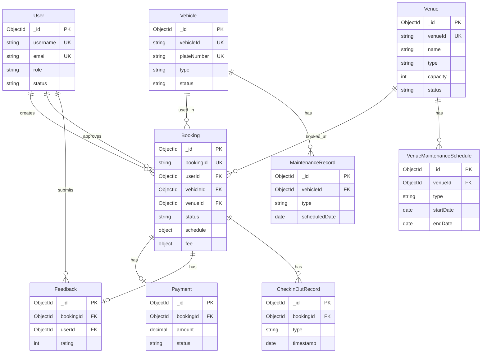

# SmartTrack 系统 ER 图集合 (Entity-Relationship Diagrams Collection)

## 文档概述

本文档集合包含 SmartTrack 智能试车场管理系统各子系统的详细实体关系图（ER Diagram），使用 Mermaid 语法编写，标注了所有实体间的 1:N 和 N:M 关系，并包含核心字段说明。

## 子系统 ER 图索引

### 1. 用户权限系统 (User Permission System)

**文档位置**: [01-user-permission-system.md](./01-user-permission-system.md)

**核心实体**:
- User (用户)
- Role (角色)
- Session (会话)

**关键关系**:
- User → Session (1:N) - 一个用户可以有多个活跃会话
- User → Booking (1:N) - 一个用户可以创建多个预约
- User → Booking (1:N) - 一个用户可以审批多个预约
- User → Role (N:1) - 多个用户可以属于同一角色

**业务功能**:
- 用户注册与登录
- 基于角色的访问控制 (RBAC)
- 会话管理与令牌验证
- 账号状态管理

---

### 2. 车辆系统 (Vehicle System)

**文档位置**: [02-vehicle-system.md](./02-vehicle-system.md)

**核心实体**:
- Vehicle (车辆)
- VehicleType (车型)
- Insurance (保险)
- MaintenanceRecord (维护记录)

**关键关系**:
- Vehicle → Booking (1:N) - 一辆车可以被预约多次
- Vehicle → MaintenanceRecord (1:N) - 一辆车有多条维护记录
- Vehicle → Insurance (1:1) - 每辆车有一个当前有效的保险信息
- Vehicle → VehicleType (N:1) - 多辆车可以属于同一车型

**业务功能**:
- 车辆信息管理
- 车辆状态追踪
- 保险管理与到期提醒
- 维护计划与记录
- 车辆可用性检查

---

### 3. 场地系统 (Venue System)

**文档位置**: [03-venue-system.md](./03-venue-system.md)

**核心实体**:
- Venue (场地)
- VenueType (场地类型)
- VenueFeature (场地特性)
- VenueMaintenanceSchedule (场地维护计划)

**关键关系**:
- Venue → Booking (1:N) - 一个场地可以有多个预约
- Venue → VenueMaintenanceSchedule (1:N) - 一个场地可以有多个维护计划
- Venue → VenueType (N:1) - 多个场地可以属于同一类型
- Venue ↔ VenueFeature (N:M) - 场地和特性是多对多关系

**业务功能**:
- 场地信息管理
- 场地容量管理
- 动态定价策略
- 维护计划管理
- 场地使用率统计

---

### 4. 预约系统 (Booking System)

**文档位置**: [04-booking-system.md](./04-booking-system.md)

**核心实体**:
- Booking (预约)
- Payment (支付)
- Feedback (反馈)
- CheckInOutRecord (签到签退记录)

**关键关系**:
- Booking → User (N:1) - 多个预约可以由同一用户创建
- Booking → User (N:1) - 多个预约可以由同一审批人审批
- Booking → Vehicle (N:1) - 多个预约可以使用同一车辆
- Booking → Venue (N:1) - 多个预约可以在同一场地
- Booking → Payment (1:1) - 每个预约有一个支付记录
- Booking → Feedback (1:1) - 每个预约可以有一条反馈
- Booking → CheckInOutRecord (1:N) - 一个预约可以有多条签到/签退记录

**业务功能**:
- 预约创建与管理
- 审批流程
- 时间冲突检测
- 费用计算与结算
- 签到签退管理
- 用户反馈收集

---

## 系统间关系概览



## 关系类型说明

### 1:N (One-to-Many) 关系

表示一个实体实例可以关联多个另一实体的实例。

**系统中的 1:N 关系**:
- User → Booking: 一个用户可以创建多个预约
- Vehicle → Booking: 一辆车可以被预约多次（不同时间）
- Venue → Booking: 一个场地可以有多个预约（受容量限制）
- Vehicle → MaintenanceRecord: 一辆车有多条维护记录
- Venue → VenueMaintenanceSchedule: 一个场地有多个维护计划
- Booking → CheckInOutRecord: 一个预约有多条签到/签退记录

### 1:1 (One-to-One) 关系

表示两个实体实例之间是一对一的关系。

**系统中的 1:1 关系**:
- Booking → Payment: 每个预约有一个支付记录
- Booking → Feedback: 每个预约可以有一条反馈
- Vehicle → Insurance: 每辆车有一个当前有效的保险信息

### N:M (Many-to-Many) 关系

表示多个实体实例可以关联多个另一实体的实例。

**系统中的 N:M 关系**:
- Venue ↔ VenueFeature: 一个场地可以有多个特性，一个特性可以被多个场地拥有

### N:1 (Many-to-One) 关系

表示多个实体实例可以关联同一个另一实体的实例。

**系统中的 N:1 关系**:
- User → Role: 多个用户可以属于同一角色
- Vehicle → VehicleType: 多辆车可以属于同一车型
- Venue → VenueType: 多个场地可以属于同一类型
- Booking → User: 多个预约可以由同一用户创建
- Booking → Vehicle: 多个预约可以使用同一车辆
- Booking → Venue: 多个预约可以在同一场地

## 外键约束规范

### 外键命名规范

- 单数实体：`{entityName}Id` (如 `userId`, `vehicleId`)
- 嵌套对象中的外键：`{objectName}.{entityName}Id` (如 `approval.approvedBy`)

### 外键引用规范

所有外键字段类型为 `ObjectId`，引用目标实体的 `_id` 字段。

**示例**:
```typescript
// Booking 实体
{
  userId: ObjectId,           // 引用 User._id
  vehicleId: ObjectId,        // 引用 Vehicle._id
  venueId: ObjectId,          // 引用 Venue._id
  approval: {
    approvedBy: ObjectId,     // 引用 User._id
  }
}
```

### 级联操作策略

| 操作场景 | 策略 | 说明 |
|---------|------|------|
| 删除用户 | 软删除 | 用户标记为 `inactive`，保留历史预约记录 |
| 删除车辆 | 软删除 | 车辆标记为 `retired`，保留历史预约记录 |
| 删除场地 | 软删除 | 场地标记为 `closed`，保留历史预约记录 |
| 删除预约 | 级联删除 | 同时删除关联的 Payment、Feedback、CheckInOutRecord |
| 删除维护记录 | 保留 | 维护记录作为历史数据永久保留 |

## 索引策略总结

### 唯一索引 (Unique Index)

确保字段值全局唯一。

**应用场景**:
- `User.username`
- `User.email`
- `Vehicle.vehicleId`
- `Vehicle.plateNumber`
- `Venue.venueId`
- `Booking.bookingId`

### 组合索引 (Compound Index)

提高多字段联合查询的性能。

**应用场景**:
- `{ userId: 1, status: 1 }` - 查询用户特定状态的预约
- `{ vehicleId: 1, status: 1, 'schedule.startTime': 1 }` - 检查车辆占用
- `{ venueId: 1, status: 1, 'schedule.startTime': 1 }` - 检查场地占用
- `{ type: 1, status: 1 }` - 查询特定类型的可用车辆/场地

### 时间索引 (Date Index)

优化时间范围查询和排序。

**应用场景**:
- `{ 'schedule.startTime': 1 }` - 预约时间查询
- `{ createdAt: -1 }` - 按创建时间倒序
- `{ 'insurance.expiryDate': 1 }` - 保险到期提醒

### TTL 索引 (Time-To-Live Index)

自动删除过期数据。

**应用场景**:
- `Session.expiresAt` - 自动清理过期会话

## 业务规则引擎集成

系统使用以下技术实现业务逻辑：

### XState 状态机

**用途**: 管理实体状态流转

**应用场景**:
- 预约状态流转: `pending → confirmed → in-progress → completed`
- 车辆状态流转: `available → booked → in-use → maintenance`
- 场地状态流转: `available → occupied → maintenance → closed`
- 支付状态流转: `pending → completed/failed → refunded`

### Zen Engine 规则引擎

**用途**: 配置化业务规则决策

**应用场景**:
- 费用计算规则: 根据车型、场地、时长、时段动态计费
- 准入校验规则: 检查用户资质、车辆保险、场地限制
- 容量管理规则: 判断场地是否可用
- 可用性检查: 车辆和场地的资格验证

## 数据一致性保证

### 事务支持

使用 MongoDB 事务确保跨集合操作的原子性。

**关键操作**:
- 创建预约 + 更新车辆状态
- 审批预约 + 发送通知
- 签退 + 费用结算 + 释放资源

### 并发控制

使用乐观锁或悲观锁防止并发冲突。

**高并发场景**:
- 多用户同时预约同一车辆
- 多用户同时预约同一场地
- 预约审批与用户取消并发

### 数据校验

使用 Zod 进行运行时类型校验和 Mongoose Schema 进行数据库层校验。

**校验层次**:
1. 前端表单校验 (react-hook-form + Zod)
2. API 参数校验 (Zod Schema)
3. 数据库模型校验 (Mongoose Schema)

## 性能优化建议

### 查询优化

1. **使用索引**: 为常用查询条件创建合适的索引
2. **分页查询**: 限制单次返回的数据量
3. **字段投影**: 只查询需要的字段
4. **避免深层嵌套查询**: 合理使用 populate 或手动关联

### 缓存策略

1. **Redis 缓存**: 缓存热门数据和频繁查询结果
2. **缓存失效**: 设置合理的 TTL，数据更新时主动清除缓存
3. **缓存预热**: 系统启动时预加载常用数据

### 数据归档

1. **定期归档**: 归档 6 个月前的已完成预约
2. **历史数据**: 保留统计数据用于分析和报表
3. **备份策略**: 定期备份关键数据

## 安全考虑

### 数据访问控制

1. **基于角色的访问控制 (RBAC)**: 不同角色有不同的数据访问权限
2. **行级安全**: 用户只能访问自己创建的预约（除管理员外）
3. **字段级安全**: 敏感字段（如密码哈希）不返回给前端

### 数据完整性

1. **外键约束**: 确保引用的实体存在
2. **数据校验**: 使用 Schema 约束确保数据格式正确
3. **事务支持**: 关键操作使用事务保证一致性

### 审计日志

1. **操作日志**: 记录所有关键操作（创建、修改、删除）
2. **访问日志**: 记录数据访问行为
3. **异常日志**: 记录系统异常和错误

## 相关文档

- [核心数据模型定义](../../AI_DEVELOPMENT.md#2-核心数据模型-core-data-models)
- [认证模块设计](../auth_design.md)
- [API 接口规范](../../AI_DEVELOPMENT.md#api-规范)
- [状态机实现](../../../lib/state-machines/)
- [业务规则配置](../../../lib/rules/)
- [数据库模型](../../../lib/db/models/)
- [服务层实现](../../../lib/db/services/)

## 版本历史

| 版本 | 日期 | 作者 | 变更说明 |
|------|------|------|---------|
| v1.0 | 2026-01-26 | GitHub Copilot | 初始版本，完整定义四大子系统 ER 图 |

## 维护说明

本文档集合应与实际数据模型实现保持同步。当数据库 Schema 发生变化时，必须同步更新对应的 ER 图文档。

**更新流程**:
1. 修改数据库模型 (`lib/db/models/`)
2. 更新对应的 ER 图文档
3. 更新本索引文件（如有新增子系统）
4. 提交代码审查

**文档规范**:
- 使用 Mermaid 语法绘制 ER 图
- 标注所有字段类型和约束
- 说明所有关系类型（1:1, 1:N, N:M）
- 提供实际使用示例代码
- 包含性能优化建议

---

**文档生成时间**: 2026-01-26  
**适用版本**: SmartTrack v1.0  
**维护团队**: SmartTrack Development Team
