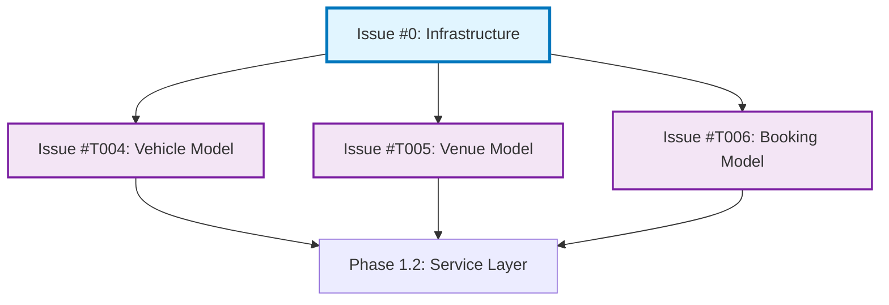

# SmartTrack GitHub Issues - 创建指南

本目录包含预先准备好的 Issue 模板，用于在 GitHub 上创建对应的 Issue。

---

## 📋 Issue 列表

### Issue #0: 【Infrastructure】详细设计规范文档与 TDD 基础环境搭建
- **文件**: `ISSUE_000_INFRASTRUCTURE.md`
- **优先级**: P0 (最高)
- **预估时间**: 3-4 天
- **依赖**: 无（这是所有开发的基础）
- **描述**: 建立项目开发基础设施，包括详细设计文档、测试环境、类型定义

### Issue #T004: Vehicle 模型定义
- **文件**: `ISSUE_T004_VEHICLE_MODEL.md`
- **优先级**: P1
- **预估时间**: 1 天
- **依赖**: Issue #0
- **描述**: 实现 Vehicle 数据模型（Mongoose Schema + 单元测试）

### Issue #T005: Venue 模型定义
- **文件**: `ISSUE_T005_VENUE_MODEL.md`
- **优先级**: P1
- **预估时间**: 1 天
- **依赖**: Issue #0
- **描述**: 实现 Venue 数据模型（Mongoose Schema + 单元测试）

### Issue #T006: Booking 模型定义
- **文件**: `ISSUE_T006_BOOKING_MODEL.md`
- **优先级**: P1
- **预估时间**: 1 天
- **依赖**: Issue #0
- **描述**: 实现 Booking 数据模型（核心业务模型，最复杂）

---

## 🚀 如何创建这些 Issue

由于 AI 助手无法直接访问 GitHub API 创建 Issue，请按照以下步骤手动创建：

### 方法 1: 通过 GitHub Web UI 创建

1. **打开 GitHub 仓库**
   ```
   https://github.com/litantai/SmartTrack/issues
   ```

2. **点击 "New Issue" 按钮**

3. **对于每个 Issue**：
   - 复制对应 `.md` 文件的内容
   - 粘贴到 Issue 描述框
   - 设置 Title（从文件中复制）
   - 添加 Labels（从文件 Metadata 部分复制）
   - 点击 "Submit new issue"

### 方法 2: 通过 GitHub CLI (gh) 创建

如果你已安装 GitHub CLI，可以使用以下命令快速创建：

```bash
# 进入项目根目录
cd /path/to/SmartTrack

# 创建 Issue #0
gh issue create \
  --title "【Infrastructure】详细设计规范文档与 TDD 基础环境搭建" \
  --body-file docs/issues/ISSUE_000_INFRASTRUCTURE.md \
  --label "infrastructure,priority:P0,complexity:high,documentation"

# 创建 Issue #T004
gh issue create \
  --title "Vehicle 模型定义 (Vehicle Model Definition)" \
  --body-file docs/issues/ISSUE_T004_VEHICLE_MODEL.md \
  --label "data-layer,priority:P1,complexity:medium,parallel:yes"

# 创建 Issue #T005
gh issue create \
  --title "Venue 模型定义 (Venue Model Definition)" \
  --body-file docs/issues/ISSUE_T005_VENUE_MODEL.md \
  --label "data-layer,priority:P1,complexity:medium,parallel:yes"

# 创建 Issue #T006
gh issue create \
  --title "Booking 模型定义 (Booking Model Definition)" \
  --body-file docs/issues/ISSUE_T006_BOOKING_MODEL.md \
  --label "data-layer,priority:P1,complexity:high,parallel:yes"
```

### 方法 3: 通过 GitHub API 创建 (使用 curl)

```bash
# 设置你的 GitHub Personal Access Token
GITHUB_TOKEN="your_github_token_here"
REPO_OWNER="litantai"
REPO_NAME="SmartTrack"

# 创建 Issue #0
curl -X POST \
  -H "Authorization: token $GITHUB_TOKEN" \
  -H "Accept: application/vnd.github.v3+json" \
  https://api.github.com/repos/$REPO_OWNER/$REPO_NAME/issues \
  -d '{
    "title": "【Infrastructure】详细设计规范文档与 TDD 基础环境搭建",
    "body": "'"$(cat docs/issues/ISSUE_000_INFRASTRUCTURE.md)"'",
    "labels": ["infrastructure", "priority:P0", "complexity:high", "documentation"]
  }'

# 对其他 Issue 重复相同步骤...
```

---

## 📊 Issue 依赖关系



---

## ✅ 创建后的验证

创建 Issue 后，请检查：

- [ ] Issue 编号是否正确（如 Issue #0）
- [ ] Title 是否清晰明确
- [ ] Labels 是否正确设置
- [ ] 描述内容是否完整（包含任务目标、验收标准等）
- [ ] 依赖关系是否在 Issue 中标注

---

## 🔗 相关链接

- **GitHub Issues 页面**: https://github.com/litantai/SmartTrack/issues
- **GitHub CLI 文档**: https://cli.github.com/manual/gh_issue_create
- **GitHub API 文档**: https://docs.github.com/en/rest/issues/issues#create-an-issue

---

## 💡 提示

1. **优先创建 Issue #0**，因为它是所有其他 Issue 的前置依赖
2. **Issue #T004、#T005、#T006 可以并行开发**，分配给不同的开发者
3. 在创建 Issue 时，可以使用 GitHub 的 Milestone 功能将它们组织到 "Phase 1.1 - Data Models" 里程碑中
4. 考虑使用 GitHub Projects 创建看板，可视化追踪这些 Issue 的进度

---

**最后更新**: 2026-01-26  
**准备者**: AI Assistant (GitHub Copilot)
